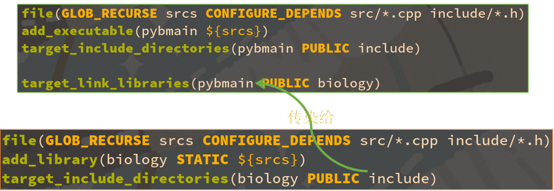

# 现代 CMake 模块化项目管理指南

## 文件/目录组织规范

> 基于 CMake 的 C/C++ 项目，如何优雅地、模块化地组织大量源文件？

**推荐的目录组织方式**

目录组织格式：

- 项目名/include/项目名/模块名.h
- 项目名/src/模块名.cpp

CMakeLists.txt 中写：

- target_include_directories(项目名 PUBLIC include)

源码文件中写：

- #include <项目名/模块名.h>
- 项目名::函数名();

头文件（项目名/include/项目名/模块名.h）中写：

```c++
#pragma once
namespace 项目名 {
	void 函数名();
}
```

实现文件（项目名/src/模块名.cpp）中写：

```c++
#include <项目名/模块名.h>
namespace 项目名 {
	void 函数名() { 函数实现 }
}
```

**推荐的目录组织方式**

```shell
.
├── CMakeLists.txt
├── biology
│   ├── CMakeLists.txt
│   ├── include
│   │   └── biology
│   │       ├── Animal.h
│   │       └── Carer.h
│   └── src
│       ├── Animal.cpp
│       └── Carer.cpp
├── cmake
│   └── MyUsefulFuncs.cmake
└── pybmain
    ├── CMakeLists.txt
    ├── include
    │   └── pybmain
    │       └── myutils.h
    └── src
        └── main.cpp
```

### 划分子项目

- 大型的项目，往往会划分为几个子项目。
- 即使你只有一个子项目，也建议你先创建一个子目录，方便以后追加新的子项目。
- 左图的案例中，我们在根目录下，创建了两个子项目 `biology `和 `pybmain`，他们分别在各自的目录下有自己的 CMakeLists.txt。

### 根项目的 CMakeLists.txt 配置

```cmake
cmake_minimum_required(VERSION 3.18)

if (NOT CMAKE_BUILD_TYPE)
    set(CMAKE_BUILD_TYPE Release)
endif()
set(CMAKE_CXX_STANDARD 20)
set(CMAKE_CXX_STANDARD_REQUIRED ON)
set(CMAKE_CXX_EXTENSIONS OFF)
set(CMAKE_MODULE_PATH "${CMAKE_CURRENT_LIST_DIR}/cmake;${CMAKE_MODULE_PATH}")

project(CppCMakeDemo LANGUAGES CXX)

include(MyUsefulFuncs)

add_subdirectory(pybmain)
add_subdirectory(biology)
```

- 在根项目的 CMakeLists.txt 中，设置了默认的构建模式，设置了统一的 C++ 版本等各种选项。然后通过 project 命令初始化了根项目。
- 随后通过 add_subdirectory 把两个子项目 `pybmain `和 `biology `添加进来（顺序无关紧要），这会调用 pybmain/CMakeLists.txt 和 biology/CMakeLists.txt。

### 子项目的 CMakeLists.txt 配置

```cmake
file(GLOB_RECURSE srcs CONFIGURE_DEPENDS src/*.cpp include/*.h)
add_library(biology STATIC ${srcs})
target_include_directories(biology PUBLIC include)
```

- 子项目的 CMakeLists.txt 就干净许多，只是创建了 biology 这个静态库对象，并通过 GLOB_RECRUSE 为他批量添加了所有位于 src 和 include 下源码和头文件。
- 根项目的 CMakeLists.txt 负责处理全局有效的设定。而子项目的 CMakeLists.txt 则仅考虑该子项目自身的设定，比如他的头文件目录，要链接的库等等。

### 子项目的头文件

- 这里我们给 biology 设置了头文件搜索路径 include。
- 因为子项目的 CMakeLists.txt 里指定的路径都是相对路径，所以这里指定 include 实际上是：根/biology/include。
- 注意我们用了 PUBLIC 修饰符，这是为了让链接 `biology `的 `pybmain `也能够共享 根/biology/include 这个头文件搜索路径。

### 子项目的源文件

- 这里我们给 `biology `批量添加了` src/*.cpp `下的全部源码文件。
- 明明只有 `*.cpp `需要编译，为什么还添加了` include/*.h`？为了头文件也能被纳入 VS 的项目资源浏览器，方便编辑。
- 因为子项目的 CMakeLists.txt 里指定的路径都是相对路径，所以这里指定` src `实际上是：`根/biology/src`。

### GLOB 和 GLOB_RECRUSE 的区别

```cmake
file (GLOB myvar CONFIGURE_DEPENDS src/*.cpp)
file (GLOB_RECURSE myvar CONFIGURE_DEPENDS src/*.cpp)
```

都是按照通配符批量匹配文件，有什么区别？

```cm
GLOB：			src/main.cpp（√）		   src/test/main.cpp（×）
GLOB_RECURSE：    src/main.cpp（√）		src/test/main.cpp（√）
```

区别在于 `GLOB_RECURSE` 允许` * `匹配嵌套的目录。

加了 CONFIGURE_DEPENDS 这个选项有什么区别？

- 如果不加，在你创建新文件时，myvar 不会自动更新，还是旧的那几个文件，可能出现 undefined symbol，需要重新运行 cmake -B build 才能更新。
- 加了，则每次 cmake --build 时自动检测目录是否更新，如果目录有新文件了，CMake 会自动帮你重新运行 cmake -B build 更新 myvar 变量。

### 头文件和源文件的一一对应关系

- 通常每个头文件都有一个对应的源文件，两个文件名字应当相同（方便我们理解，也方便 IDE 跳转），只有后缀名不一样。
- 如果是一个类，则文件名应和类名相同，方便查找（Animal.cpp）。
- 头文件中包含函数和类的声明，源文件则包含他们的实现。

### 只有头文件，没有源文件的情况

- 有时我们会直接把实现直接写在头文件里，这时可以没有与之对应的源文件，只有一个头文件。
- 注意：在头文件里直接实现函数时，要加 static 或 inline 关键字。

### 每新增一个功能模块，需要创建两个文件

- 添加一个新功能模块 Carer 时，同时添加同名的源文件和头文件。
- 头文件中的声明和源文件中的实现一一对应。

### 一个模块依赖其他模块，则应导入他的头文件

- 如果新模块（Carer）中用到了其他模块（Animal）的类或函数，则需要在新模块（Carer）的头文件和源文件中都导入其他模块（Animal）的头文件。
- 注意不论是项目自己的头文件还是外部的系统的头文件，请全部统一采用 <项目名/模块名.h> 的格式。不要用 “模块名.h” 这种相对路径的格式，避免模块名和系统已有头文件名冲突。

### 依赖其他模块但不解引用，则可以只前向声明不导入头文件

- 如果模块 Carer 的头文件 Carer.h 虽然引用了其他模块中的 Animal 类，但是他里面并没有解引用 Animal，只有源文件 Carer.cpp 解引用了 Animal。
- 那么这个头文件是不需要导入 Animal.h 的，只需要一个前置声明 struct Animal，只有实际调用了 Animal 成员函数的源文件需要导入 Animal.h。
- 好处：加快编译速度，防止循环引用。

### 以项目名为名字空间（namsepace），避免符号冲突

- 在声明和定义外面都套一层名字空间，例如此处我的子项目名是 biology，那我就 biology::Animal。避免暴露全局的 Animal。这是因为万一有个“不拘一格”的第三方库也暴露个全局的 Animal，两个符号就会发生冲突，由于类符号都具有 weak 属性，链接器会随机选择一个覆盖掉，非常危险！

> （关于符号的 weak 属性，以后单独开一门 C++ 课讲讲，这一课还是重点关注 CMake）

### 依赖另一个子项目，则需要链接他



- 让 pybmain 链接上 biology：target_link_libraries(pybmain PUBLIC biology)
- 由于 PUBLIC 属性具有传染性，根/biology/include 现在也加入 pybmain 的头文件搜索路径了，因此 pybmain 里可以 #include 到 biology 的头文件。
- 同理如果又有一个 target_link_libraries(zxxpig PUBLIC pybmain) 那么 zxxpig 也有 pybmain 和 biology 的所有头文件搜索路径了。（PUBLIC 的原理详见第一期课程）

### 你知道吗？CMake 也有 include 功能

- 和 C/C++ 的 #include 一样，CMake 也有一个 include 命令。
- 你写 include(XXX)，则他会在 CMAKE_MODULE_PATH 这个列表中的所有路径下查找 XXX.cmake 这个文件。
- 这样你可以在 XXX.cmake 里写一些你常用的函数，宏，变量等。

```cmake
set(CMAKE_MODULE_PATH "${CMAKE_CURRENT_LIST_DIR}/cmake;${CMAKE_MODULE_PATH}")

project(CppCMakeDemo LANGUAGES CXX)

include(MyUsefulFuncs)
```

```cmake
macro (my_add_target name type)
    # 用法: my_add_target(pybmain EXECUTABLE)
    file(GLOB_RECURSE srcs CONFIGURE_DEPENDS src/*.cpp src/*.h)
    if ("${type}" MATCHES "EXECUTABLE")
        add_executable(${name} ${srcs})
    else()
        add_library(${name} ${type} ${srcs})
    endif()
    target_include_directories(${name} PUBLIC include)
endmacro()

set(SOME_USEFUL_GLOBAL_VAR    ON)
set(ANOTHER_USEFUL_GLOBAL_VAR OFF)
```

**macro 和 function 的区别**

- macro 相当于直接把代码粘贴过去，直接访问调用者的作用域。这里写的相对路径 include 和 src，是基于调用者所在路径。
- function 则是会创建一个闭包，优先访问定义者的作用域。这里写的相对路径 include 和 src，则是基于定义者所在路径。

**include 和 add_subdirectory 的区别**

- include 相当于直接把代码粘贴过去，直接访问调用者的作用域。这里创建的变量和外面共享，直接 set(key val) 则调用者也有 ${key} 这个变量了。
- function 中则是基于定义者所在路径，优先访问定义者的作用域。这里需要 set(key val PARENT_SCOPE) 才能修改到外面的变量。

## 第三方库/依赖项配置

> 用 find_package 寻找系统中安装的第三方库并链接他们

### find_package 命令

常用参数列表一览：

```cmake
find_package(<PackageName> [version] [EXACT] [QUIET] [CONFIG] [MODULE]
             [REQUIRED] [[COMPONENTS] [components...]]
             [OPTIONAL_COMPONENTS components...]
)
```

### find_package 命令用法举例

- find_package(OpenCV)

  查找名为 OpenCV 的包，找不到不报错，事后可以通过 ${OpenCV_FOUND} 查询是否找到。

- find_package(OpenCV QUIET)

  查找名为 OpenCV 的包，找不到不报错，也不打印任何信息。

- find_package(OpenCV REQUIRED)    # 最常见用法

  查找名为 OpenCV 的包，找不到就报错（并终止 cmake 进程，不再继续往下执行）。

- find_package(OpenCV REQUIRED COMPONENTS core videoio)

  查找名为 OpenCV 的包，找不到就报错，且必须具有 OpenCV::core 和 OpenCV::videoio 这两个组件，如果没有这两个组件也会报错。

- find_package(OpenCV REQUIRED OPTIONAL_COMPONENTS core videoio)

  查找名为 OpenCV 的包，找不到就报错，可具有 OpenCV::core 和 OpenCV::videoio 这两个组件，没有这两组件不会报错，通过 ${OpenCV_core_FOUND} 查询是否找到 core 组件。

### find_package 说是找“包”，到底是在找什么？

- find_package(OpenCV) 实际上是在找一个名为 OpenCVConfig.cmake 的文件。
- 注：出于历史兼容性考虑，除了 OpenCVConfig.cmake 以外 OpenCV-config.cmake 这个文件名也会被 CMake 识别到。

- 同理，find_package(Qt5) 则是会去找名为 Qt5Config.cmake 的文件。
- 这些形如 包名 + Config.cmake 的文件，我称之为包配置文件。
- Qt5Config.cmake 是你安装 Qt5 时，随 libQt5Core.so 等实际的库文件，一起装到你的系统中去的。以我的 Arch Linux 系统为例：
- 包配置文件位于 /usr/lib/cmake/Qt5/Qt5Config.cmake。
- 实际的动态库文件位于 /usr/lib/libQt5Core.so。

- 因此 find_package 并不是直接去找具体的动态库文件和头文件（例如  libQt5Core.so）。
- 而是去找包配置文件（例如Qt5Config.cmake），这个配置文件里包含了包的具体信息，包括动态库文件的位置，头文件的目录，链接时需要开启的编译选项等等。而且某些库都具有多个子动态库，例如 Qt 就有 libQt5Core.so、libQt5Widgets.so、libQt5Network.so。因此 CMake 要求所有第三方库作者统一包装成一个 Qt5Config.cmake 文件包含所有相关信息（类似于 nodejs 的 package.json），比你单独的一个个去找动态库文件要灵活的多。
- 包配置文件由第三方库的作者（Qt的开发团队）提供，在这个库安装时（Qt的安装程序或apt install等）会自动放到 /usr/lib/cmake/XXX/XXXConfig.cmake 这个路径（其中XXX是包名），供 CMake 用户找到并了解该包的具体信息。
- /usr/lib/cmake 这个位置是 CMake 和第三方库作者约定俗成的，由第三方库的安装程序负责把包配置文件放到这里。如果第三方库的作者比较懒，没提供 CMake 支持（由安装程序提供XXXConfig.cmake），那么得用另外的一套方法（FindXXX.cmake），稍后细谈。

### Windows 系统下的搜索路径

```txt
<prefix>/
<prefix>/cmake/
<prefix>/<name>*/
<prefix>/<name>*/cmake/
<prefix>/<name>*/(lib/<arch>|lib*|share)/cmake/<name>*/
<prefix>/<name>*/(lib/<arch>|lib*|share)/<name>*/
<prefix>/<name>*/(lib/<arch>|lib*|share)/<name>*/cmake/

其中 <prefix> 是变量 ${CMAKE_PREFIX_PATH}，Windows 平台默认为 C:/Program Files。
<name> 是你在 find_package(<name> REQUIRED) 命令中指定的包名。
<arch> 是系统的架构名。
```

### Unix 类系统下的搜索路径

```txt
<prefix>/(lib/<arch>|lib*|share)/cmake/<name>*/
<prefix>/(lib/<arch>|lib*|share)/<name>*/
<prefix>/(lib/<arch>|lib*|share)/<name>*/cmake/
<prefix>/<name>*/(lib/<arch>|lib*|share)/cmake/<name>*/
<prefix>/<name>*/(lib/<arch>|lib*|share)/<name>*/
<prefix>/<name>*/(lib/<arch>|lib*|share)/<name>*/cmake/

其中 <prefix> 是变量 ${CMAKE_PREFIX_PATH}，Unix 平台默认为 /usr。
<name> 是你在 find_package(<name> REQUIRED) 命令中指定的包名。
<arch> 是系统的架构，例如 x86_64-linux-gnu 或 i386-linux-gnu。
（用于伺候 Ubuntu 喜欢把库文件套娃在 /usr/lib/x86_64-linux-gnu 目录下）
```

### 举例说明 find_package 搜索路径

例如你是 64 位的 Linux 系统，find_package(Qt5 REQUIRED) 会依次搜索：

```txt
/usr/lib/cmake/Qt5/Qt5Config.cmake
/usr/lib/x86_64-linux-gnu/cmake/Qt5/Qt5Config.cmake
/usr/share/cmake/Qt5/Qt5Config.cmake
/usr/lib/Qt5/Qt5Config.cmake
/usr/lib/x86_64-linux-gnu/Qt5/Qt5Config.cmake
/usr/share/Qt5/Qt5Config.cmake
/usr/Qt5/lib/cmake/Qt5/Qt5Config.cmake
/usr/Qt5/lib/x86_64-linux-gnu/cmake/Qt5/Qt5Config.cmake
/usr/Qt5/share/cmake/Qt5/Qt5Config.cmake
/usr/Qt5/lib/Qt5/Qt5Config.cmake
/usr/Qt5/lib/x86_64-linux-gnu/Qt5/Qt5Config.cmake
/usr/Qt5/share/Qt5/Qt5Config.cmake
```

例如你是 64 位的 Windows 系统，find_package(Qt5 REQUIRED) 会依次搜索：

```txt
C:/Program Files/Qt5Config.cmake
C:/Program Files/cmake/Qt5Config.cmake
C:/Program Files/Qt5/Qt5Config.cmake
C:/Program Files/Qt5/cmake/Qt5Config.cmake
C:/Program Files/Qt5/lib/cmake/Qt5/Qt5Config.cmake
C:/Program Files/Qt5/lib/x86_64-windows-gnu/cmake/Qt5/Qt5Config.cmake
C:/Program Files/Qt5/share/cmake/Qt5/Qt5Config.cmake
C:/Program Files/Qt5/lib/Qt5/Qt5Config.cmake
C:/Program Files/Qt5/lib/x86_64-windows-gnu/Qt5/Qt5Config.cmake
C:/Program Files/Qt5/share/Qt5/Qt5Config.cmake
```

还有一点，<name> 可以有额外后缀，且不分大小写（无论 Linux 还是 Windows），例如：

```txt
C:/Program Files/Qt5/cmake/Qt5Config.cmake
C:/Program Files/Qt5.12.1/cmake/Qt5Config.cmake
C:/Program Files/qt5dnmd/cmake/Qt5Config.cmake
同样都是可以被 find_package(Qt5 REQUIRED) 搜索到的。
/usr/lib/cmake/OpenCV/OpenCVConfig.cmake
/usr/lib/cmake/opencv4/OpenCVConfig.cmake
同样都是可以被 find_package(OpenCV REQUIRED) 搜索到的。
```

### 安装在非标准路径的库

- 以 Qt5 为例，如果你安装在下列标准路径，find_package 能够自动找到。
- Windows：C:/Program Files/Qt5.12.1/lib/cmake/Qt5/Qt5Config.cmake。
- Linux：/usr/lib/cmake/Qt5/Qt5Config.cmake。
- 但是假如我的库不是装在这些标准路径，而是我自定义的路径，怎么办？
- 而且即使你不自定义安装路径，Windows 版的 Qt 默认安装就会安装到：
- C:/Qt5.12.1/msvc2017_64/lib/cmake/Qt5/Qt5Config.cmake。
- 何况我们同学有的还喜欢装到 D 盘去，Windows 是非标准路径的重灾区，他就没有一个统一的 /usr/lib 目录。然而你一旦把库安装到非标准路径，find_package 是找不到的。
- 这时你需要手动指定一个变量告诉他在哪儿，可以是普通变量 ${Qt5_DIR}，也可以是环境变量 $ENV{Qt5_DIR}，两个中只要设置了任何一个 find_package 都可以识别到。
- 变量一般通过命令行 -DQt5_DIR=”C:/Program Files/Qt5.12.1/lib/cmake/Qt5” 设置。

**举例，Windows 系统，Qt5**

例如我把 Qt5 安装到了 D:/Qt5.12.1。
首先找到他里面的 Qt5Config.cmake 文件所在位置（可以用文件管理器的“搜索”功能）。
假如你找到该文件的位置是 D:/Qt5.12.1/msvc2017/lib/cmake/Qt5/Qt5Config.cmake，那么请你设置变量 Qt5_DIR 为 D:/Qt5.12.1/msvc2017/lib/cmake/Qt5。有三种设置方法：

1. 单次有效。在 configure 阶段，可以从命令行设置（注意要加引号）：
   cmake -B build -DQt5_DIR=”D:/Qt5.12.1/msvc2017/lib/cmake/Qt5”
2. 全局启用。右键“我的电脑”->“管理”->“高级”添加一个环境变量 Qt5_DIR 值为 D:/Qt5.12.1/msvc2017/lib/cmake/Qt5，然后重启 Visual Studio。这样以后你每次构建任何项目，find_package 都能自动找到这个路径的 Qt5 包了。
3. 单项目有效。直接在你自己项目的 CMakeLists.txt 最开头写一行（注意要加引号）：
   set(Qt5_DIR ”D:/Qt5.12.1/msvc2017/lib/cmake/Qt5”)    # 一定要加在最前面！

**举例，Linux 系统，Qt5**

例如我把 Qt5 安装到了 /opt/Qt5.12.1。
首先找到他里面的 Qt5Config.cmake 文件所在位置（可以用文件管理器的“搜索”功能）。
假如你找到该文件的位置是 /opt/Qt5.12.1/lib/cmake/Qt5/Qt5Config.cmake，那么请你设置变量 Qt5_DIR 为 /opt/Qt5.12.1/lib/cmake/Qt5。有三种设置方法：

1. 单次有效。在 configure 阶段，可以从命令行设置：
   cmake -B build -DQt5_DIR=”/opt/Qt5.12.1/lib/cmake/Qt5”
2. 全局启用。修改你的 ~/.bashrc 文件添加环境变量：
   export Qt5_DIR=”/opt/Qt5.12.1/lib/cmake/Qt5”，然后重启终端。这样以后你每次构建任何项目，find_package 都能自动找到这个路径的 Qt5 包了。
3. 单项目有效。直接在你自己项目的 CMakeLists.txt 最开头写一行：
   set(Qt5_DIR ”/opt/Qt5.12.1/lib/cmake/Qt5”)    # 一定要加在最前面！

三种方案利弊分析

- 单次有效（通过命令行）最安全，小彭老师高度推荐。~
- 全局有效（添加环境变量）可能影响以后其他项目。比如你 A 项目依赖 Qt5.12.1，你设置了环境变量 Qt5_DIR=/opt/Qt5.12.1，后来又搞了个 B 项目依赖 Qt5.10.3，但是你忘了你设置过全局的环境变量指向 5.12.1 了，导致版本冲突。
- 单项目有效（写死在 CMakeLists.txt）虽然方便了你，但是你的 CMakeLists.txt 拿到别人电脑上（例如你通过 GitHub 开源的），可能你 set(Qt5_DIR D:/Qt5)，而人家却需要 set(Qt5_DIR E:/Qt5) 呢？就冲突了。所以“单次有效”虽然劳驾您的高抬贵手每次命令行打一下 -DQt5_DIR=”D:/Qt5”，但人家也打一下 -DQt5_DIR=”E:/Qt5”，就没有冲突，各美其美，美美与共，赋能多元化社会，下沉团队合作发力面。
- 实际上只要你不删 build，不需要每次都 -DQt5_DIR 一下，CMake 具有“记忆”功能。

```cmake
cmake -B build -DQt5_DIR=D:/Qt5   				# 只需要第一次指定好，
cmake -B build                                 	 # 以后第二次运行可以省略！
rm -rf build                                     # 只有清理了 build 以后，
cmake -B build -DQt5_DIR=D:/Qt5   				# 才需要重新指定。
```

**科普：类似 Qt 这种亲 Unix 软件，在 Windows 下的目录组织格式**

例如你安装 Qt 时设置安装路径为 D:/Qt5.12.1。
则你会看到他下面有几个子目录：
D:/Qt5.12.1/msvc2017_64（由VS2017编译64位版本）
D:/Qt5.12.1/mingw_64（由MinGW编译64位版本）
这几个目录里又分别包含：
D:/Qt5.12.1/msvc2017_64/include/qt/QtCore/qstring.h（实际的头文件，属于 Qt5::Core）
D:/Qt5.12.1/msvc2017_64/bin/Qt5Core.dll（实际的动态库文件，对应 Qt5::Core）
D:/Qt5.12.1/msvc2017_64/lib/Qt5Core.lib（实际的静态库文件，对应 Qt5::Core）
D:/Qt5.12.1/msvc2017_64/lib/cmake/Qt5/Qt5Config.cmake（包配置文件）
可以看到尽管是 Windows 版的 Qt，他内部仍然是在模仿 Linux 下 /usr 的目录组织格式。
注意这里的 Qt5Core.dll 位于 bin 目录，而不是 lib 目录，这是为什么呢？
因为 Windows 要求 exe 和 dll 位于同一目录，否则 exe 在运行时就会找不到 dll。
为了符合 Linux 分离 bin 和 lib 的组织格式，又要伺候 Windows 的沙雕同目录规则，我们通常把 dll 动态库文件视为“可执行文件”和 exe 一起放到 bin 目录，而静态库则没有运行时必须同目录的限制，所以可以照常放到 lib 目录。

Linux 用户从源码安装 Qt 这种库时，会有一个 --prefix 选项，指定安装的根路径。
默认的 --prefix 是 /usr，这个路径由全部软件共享，Qt 会把他的文件安装到以下目录：
/usr/include/qt/QtCore/qstring.h（实际的头文件，对应 Qt5::Core）
/usr/lib/libQt5Core.so（实际的动态库文件，对应 Qt5::Core）
/usr/lib/libQt5Core.a（实际的静态库文件，对应 Qt5::Core）
/usr/lib/cmake/Qt5/Qt5Config.cmake（包配置文件，用于 find_package）
假如你指定 --prefix=/usr/local，这个路径通常是用户自己手动装的软件，那么就会变成：
/usr/local/lib/cmake/Qt5/Qt5Config.cmake
假如你指定 --prefix=/opt/myqtroot，那么就会变成：
/opt/myqtroot/lib/cmake/Qt5/Qt5Config.cmake
伺候这种非常规安装，就需要设置变量 -DQt5_DIR=/opt/myqtroot/lib/cmake/Qt5 了。

**科普：亲 Unix 软件从源码安装的通用套路**

Makefile 构建系统：

```shell
./configure --prefix=/usr --with-some-options    # 生成 Makefile（这个 configure 脚本由 Autoconf 生成）
make -j 8                # 8 核心编译，生成 libtest.so
sudo make install   # 安装，拷贝到 /usr/lib/libtest.so
```

CMake 构建系统：

```shell
cmake -B build -DCMAKE_INSTALL_PREFIX=/usr -DWITH_SOME_OPTIONS=ON  # 生成 Makefile
cmake --build build --parallel 8                  # 8 核心编译，生成 libtest.so
sudo cmake --build build --target install    # 安装，拷贝到 /usr/lib/libtest.so
```

注：如果 -DCMAKE_INSTALL_PREFIX=/usr/local 则会拷贝到 /usr/local/lib/libtest.so

**如果第三方库发懒，没有提供 Config 文件怎么办？**

绝大多数常用 C++ 库都提供了 CMake 支持（即使他们本身不一定是用 CMake 构建的）：
/usr/lib/cmake/Boost-1.80.0/BoostConfig.cmake
/usr/lib/cmake/opencv4/OpenCVConfig.cmake
/usr/lib/cmake/Qt5/Qt5Config.cmake
这些 Config 文件都是由第三方库负责安装到 /usr/lib/cmake。

但是，也有少数不听话的库，官方不提供 CMake 支持，即安装时不自带 Config 文件。
恼人的是，这些不听话的库有些竟然是非常热门的库！例如 Python，CUDA，Jemalloc。
为了不影响 CMake 用户体验，CMake 发明了 Find 文件（FindXXX.cmake），你不支持我是吧？我支持你！Find 文件会在 CMake 安装时负责安装到 /usr/share/cmake/Modules。
包搜索文件可以在不知道包具体位置信息的情况下搜索他们（在 /usr/lib 等默认路径搜索）。
这些都是 CMake 自带的包搜索文件：
/usr/share/cmake/Modules/FindCUDAToolkit.cmake
/usr/share/cmake/Modules/FindPython.cmake
那么如果有个不太热门的第三方库没提供包配置文件，CMake 也没提供包搜索文件，我们该如何找到他？这就需要自己提供包搜索文件了！别担心，你不用自己写，GitHub 上有很多志士仁人已经写过了对应的包搜索文件，你搜一下 FindXXX.cmake 就能找到了。

**举例：FindJemalloc.cmake**

https://github.com/AcademySoftwareFoundation/openvdb/blob/master/cmake/FindJemalloc.cmake

- 虽然 Config 文件通常风格比较统一，都是 XXX::xxx 这种格式。但是不同的 Find 文件，特别是这种网上志士仁人自己编写的文件，风格可能千差万别（没办法，毕竟不是官方的支持嘛），很多都还是古代 CMake 的用法，例如 ${XXX_LIBRARIES}。关于具体使用的细节可以打开 FindXXX.cmake 文件查看，他里面前半部分是注释，会讲解如何使用。
- 现在你下载这个文件，放到 cmake/FindXXX.cmake。然后在你的 CMakeLists.txt 里最上面写一行：
- set(CMAKE_MODULE_PATH “${CMAKE_CURRENT_LIST_DIR}/cmake;${CMAKE_MODULE_PATH}”)
- 这样你之后的 find_package(XXX) 就会用你下载的这个 FindXXX.cmake 去找包了。

**现代 vs 古代：用法上完全不同！**

`OpenCVConfig.cmake`（现代）

```cmake
add_executable(main main.cpp)

find_package(OpenCV REQUIRED COMPONENTS core videoio)
target_link_libraries(main PUBLIC OpenCV::core)
target_link_libraries(main PUBLIC OpenCV::videoio)
```

`FindCURL.cmake`（古代）https://zhuanlan.zhihu.com/p/97369704

```cmake
find_package(CURL)
add_executable(curltest curltest.cc)
if(CURL_FOUND)
    target_include_directories(clib PRIVATE ${CURL_INCLUDE_DIR})
    target_link_libraries(curltest ${CURL_LIBRARY})
else(CURL_FOUND)
    message(FATAL_ERROR "CURL library not found")
endif(CURL_FOUND)
```

**现代和古代的区别**

- 不管是 Find 类还是 Config 类，一定要打开相应的 cmake 文件看看注释，才能确定他是古代风格还是现代风格。
- 古代 CMake 的命名规范高度不统一，有的是 ${XXX_LIBRARIES}，有的又是 ${XXX_LIBRARY} 非常沙雕，需要看相应 cmake 文件的注释，才能确定具体是怎么命名的。
- 现代 CMake 就好多了，统一用 包名::组件名 的格式。但是具体的组件名，还是要查看 cmake 文件中的注释才能确定。例如 CURL::libcurl OpenCV::core Qt5::core TBB::tbb 等。

**现代和古代区别的总结**

古代（仅用于伺候很老的库）：

```cmake
find_package(XXX)
if (NOT XXX_FOUND)
  message(FATAL_ERROR “XXX not found”)
endif()
target_include_directories(yourapp ${XXX_INCLUDE_DIRS})
target_link_libraries(yourapp ${XXX_LIBRARIES})
```

现代（小彭老师推荐）：

```cmake
find_package(XXX REQUIRED COMPONENTS xxx)
target_link_libraries(yourapp XXX::xxx)
```

大多都能同时兼容现代和古代

- 大多现代的 Find/Config 文件，都同时兼容现代和古代的用法。
- 特别古老的 Find 文件，则只能用古代的用法。
- 例如右图是 `FindCURL.cmake` 的注释，可以看到 IMPORTED Targets 章节是在介绍现代的用法，而 Result Variables 章节是在介绍古代的用法，我们尽量用现代的那种就行。

**指定使用哪种模式**

- find_package(TBB MODULE REQUIRED)

  只会寻找 FindTBB.cmake，搜索路径：

  ${CMAKE_MODULE_PATH}（默认为 /usr/share/cmake/Modules）

- find_package(TBB CONFIG REQUIRED)

  只会寻找 TBBConfig.cmake，搜索路径：

  1. ${CMAKE_PREFIX_PATH}/lib/cmake/TBB（默认为 /usr/lib/cmake/TBB）
  2. ${TBB_DIR} 或 $ENV{TBB_DIR}

- find_package(TBB REQUIRED)

  不指定则两者都会尝试，先尝试 FindTBB.cmake，再尝试 TBBConfig.cmake。

**关于 vcpkg 的坑（不用 vcpkg 的同学可以跳过这段）**

- 刚刚说了有些懒惰第三方库，比如 Jemalloc，他不提供 Config 文件，需要我们自己手写（或抄别人开源项目里的）个 Find 文件，用起来很不方便。但是 vcpkg 会为所有第三方库，即使是懒惰的 Jemalloc，都配备一个 Config 文件方便你 find_package 导入。所以用 vcpkg 时，尽量用 find_package(XXX CONFIG REQUIRED) 避免被 CMake 自带的 Find 文件误导找到别的地方（而非 vcpkg 安装的那个）的库。
- 另外注意 vcpkg 需要的 CMAKE_TOOLCHAIN_FILE 如果你用 set 设置，必须在 project 命令前面，并且修改这个变量后要删除 build 目录重新 cmake -B build 一遍才能生效（否则会在旧的环境里找，找不到 vcpkg 装的库）。

### **科普：语义版本号（semantic versioning）系统**

- 软件行业记录版本迭代普遍采用的是一套所谓的语义版本号系统，英文简称 semver。
- 通常他的格式是三个用点分隔开来的十进制数字：<major>.<minor>.<patch>
- 例如：1.2.0，0.6.8，18.11.0
- major 称为主版本号，出现功能重大变更，以至于和旧 API 不兼容的时候会增加该号。
- minor 称为次版本号，功能有所变更或增加，但依然和旧的 API 兼容时会增加该号。
- patch 称为补丁版号，功能没有改变，只是修复了一些 bug 就重新发布时会增加该号。
- 也有的软件不拘一格（例如我们的 zeno），索性用发布的日期作为版本号的三个数字，例如 2022.11.2。不论采用哪种编号方案，都是几个用点分开的数字，并且数字越大越新，且优先比较靠前面的数字。因此为了通用，CMake 支持最多四个点分开的版本号：<major>.<minor>.<patch>.<tweak>。并且如果你写 0.6.8 他会自动帮你把多余的 tweak 默认为 0，也就是说 0.6.8 == 0.6.8.0，1.2 == 1.2.0 == 1.2.0.0。
- 比较版本号时，可以用 if (${XXX_VERSION} VERSION_LESS 3.1.0) 判断大小。

### find_package 命令指定版本

find_package(OpenCV REQUIRED)
	查找名为 OpenCV 的包，不限版本，事后可以通过 ${OpenCV_VERSION} 查询找到的版本。
find_package(OpenCV 2.0.1 REQUIRED)
	查找版本在 2.0.1 以上的 OpenCV 包（version >= 2.0.1）。
find_package(OpenCV 2.0.1 EXACT REQUIRED)
	查找版本刚好为 2.0.1 的 OpenCV 包（version == 2.0.1）。

如果没写全，则没写的部分默认为 0。例如下列三者等价：
find_package(OpenCV 2 REQUIRED)
find_package(OpenCV 2.0 REQUIRED)
find_package(OpenCV 2.0.0 REQUIRED)

## 总结

安装 TBB：

```shell
cd tbb
./configure --prefix=/opt/tbbinstalldir
make -j 8
sudo make install
```

在你的项目里使用 TBB：

```shell
cd yourapp
cmake -B build -DTBB_DIR=/opt/tbbinstalldir/lib/cmake/TBB
cmake --build build --parallel 8
```

CMakeLists.txt 这样写：

```cmake
project(yourapp)
add_executable(yourapp yourmain.cpp)
find_package(TBB CONFIG REQUIRED COMPONENTS tbb)
target_link_libraries(yourapp PUBLIC TBB::tbb)
```

**古代 CMake 常见问题**

target_link_libraries(yourapp ${XXX_LIBRARIES})
target_include_directories(yourapp ${XXX_INCLUDE_DIRS})

Q: 我明明链接了 XXX 库，编译时却报错“找不到头文件 XXX.h”怎么办？
A: 你漏了上面的 2。

Q: 我明明编译都通过了，链接却报错"undefined symbol：XXXfunc"怎么办？
A: 你漏了上面的 1。

打印检查一下这两个变量是不是空的：message(“!!!!!!” ${XXX_INCLUDE_DIRS})
如果为空说明你变量名打错了，CMake 特色就是找不到变量不报错，而是视为空字符串。
去看一下 `FindXXX.cmake` 里的注释（那就是文档），到底是什么名字。

**少见的 add_subdirectory 邪教**

大部分第三方库都需要提前安装好，然后再 find_package 找到他，然后才能链接。
也有少数第三方库为了方便，还支持作为子项目加到你的项目中来，这种就不需要 :: 语法。

标准方法：
find_package(spdlog REQUIRED)
target_link_libraries(yourapp PUBLIC spdlog::spdlog)

邪教方法：
add_subdirectory(spdlog)  # 需要下载好他们的源码放到你的根目录下
target_link_libraries(yourapp PUBLIC spdlog)
