# 现代CMake

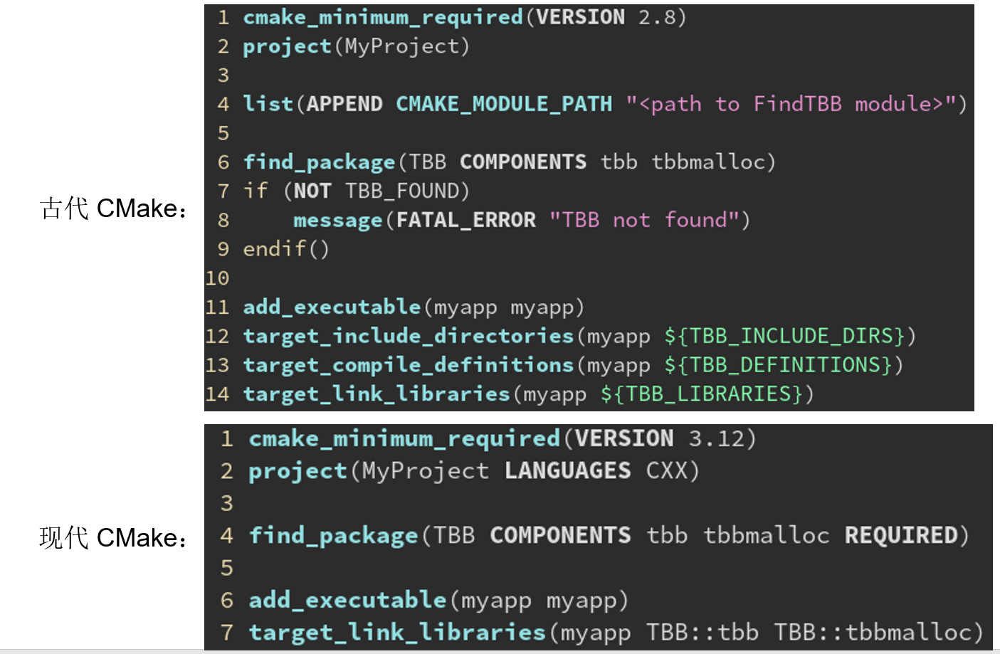

## 构建/安装方式

```cmake
# 古代 CMake

mkdir -p build	#需要先创建 build 目录
cd build #切换到 build 目录
cmake .. -DCMAKE_BUILD_TYPE=Release	#在 build 目录运行 cmake <源码目录> 生成 Makefile
make -j4	#执行本地的构建系统 make 真正开始构建（4进程并行）
make install	#让本地的构建系统执行安装步骤
cd ..	#回到源码目录

# 现代 Cmake

cmake -B build -DCMAKE_BUILD_TYPE=Release	#在源码目录用 -B 直接创建 build 目录并生成 build/Makefile
cmake --build build --parallel 4	#自动调用本地的构建系统在 build 里构建，即：make -C build -j4
cmake --build build --target install	#调用本地的构建系统执行 install 这个目标，即安装
```

## Cmake 选项

**-D 选项：指定配置变量（又称缓存变量）**

- 可见 CMake 项目的构建分为两步：
  1. 第一步是 cmake -B build，称为配置阶段（configure），这时只检测环境并生成构建规则，会在 build 目录下生成本地构建系统能识别的项目文件（Makefile 或是 .sln）
  2. 第二步是 cmake --build build，称为构建阶段（build），这时才实际调用编译器来编译代码
- 在配置阶段可以通过 -D 设置缓存变量。第二次配置时，之前的 -D 添加仍然会被保留。
- cmake -B build **-DCMAKE_INSTALL_PREFIX=/opt/openvdb-8.0**
  - 设置安装路径为 /opt/openvdb-8.0（会安装到 /opt/openvdb-8.0/lib/libopenvdb.so）
- cmake -B build **-DCMAKE_BUILD_TYPE=Release**
  - 设置构建模式为发布模式（开启全部优化）
- cmake -B build（第二次）
  - 第二次配置时没有 -D 参数，但是之前的 -D 设置的变量都会被**保留**（此时缓存里仍有你之前定义的 CMAKE_BUILD_TYPE 和 CMAKE_INSTALL_PREFIX）

**-G 选项：指定要用的生成器**

- 众所周知，CMake 是一个跨平台的构建系统，可以从 CMakeLists.txt 生成不同类型的构建系统（比如 Linux 的 make，Windows 的 MSBuild），从而让构建规则可以只写一份，跨平台使用。
- 过去的软件（例如 TBB）要跨平台，只好 Makefile 的构建规则写一份，MSBuild 也写一份。
- 现在只需要写一次 CMakeLists.txt，他会视不同的操作系统，生成不同构建系统的规则文件。
- 那个和操作系统绑定的构建系统（make、MSBuild）称为本地构建系统（native buildsystem）。
- 负责从 CMakeLists.txt 生成本地构建系统构建规则文件的，称为生成器（generator）。

```shell

-> % cmake -G
CMake Error: No generator specified for -G

Generators
  Green Hills MULTI            = Generates Green Hills MULTI files
                                 (experimental, work-in-progress).
* Unix Makefiles               = Generates standard UNIX makefiles.
  Ninja                        = Generates build.ninja files.
  Ninja Multi-Config           = Generates build-<Config>.ninja files.
  Watcom WMake                 = Generates Watcom WMake makefiles.
  CodeBlocks - Ninja           = Generates CodeBlocks project files.
  CodeBlocks - Unix Makefiles  = Generates CodeBlocks project files.
  CodeLite - Ninja             = Generates CodeLite project files.
  CodeLite - Unix Makefiles    = Generates CodeLite project files.
  Eclipse CDT4 - Ninja         = Generates Eclipse CDT 4.0 project files.
  Eclipse CDT4 - Unix Makefiles= Generates Eclipse CDT 4.0 project files.
  Kate - Ninja                 = Generates Kate project files.
  Kate - Unix Makefiles        = Generates Kate project files.
  Sublime Text 2 - Ninja       = Generates Sublime Text 2 project files.
  Sublime Text 2 - Unix Makefiles
                               = Generates Sublime Text 2 project files.
```

- Linux 系统上的 CMake 默认用是 Unix Makefiles 生成器；Windows 系统默认是 Visual Studio 2019 生成器；MacOS 系统默认是 Xcode 生成器。

- 可以用 -G 参数改用别的生成器，例如 cmake -GNinja 会生成 Ninja 这个构建系统的构建规则。Ninja 是一个高性能，跨平台的构建系统，Linux、Windows、MacOS 上都可以用。

- Ninja 可以从包管理器里安装，没有包管理器的 Windows 可以用 Python 的包管理器安装：

  pip install ninja（有趣的事实：CMake 也可以通过 pip install cmake 安装……）

- 事实上，MSBuild 是单核心的构建系统，Makefile 虽然多核心但因历史兼容原因效率一般。

- 而 Ninja 则是专为性能优化的构建系统，他和 CMake 结合都是行业标准了。

**Ninja** **和** **Makefile** **简单的对比**

性能上：Ninja > Makefile > MSBuild
Makefile 启动时会把每个文件都检测一遍，浪费很多时间。特别是有很多文件，但是实际需要构建的只有一小部分，从而是 I/O Bound 的时候，Ninja 的速度提升就很明显。
然而某些专利公司的 CUDA toolkit 在 Windows 上只允许用 MSBuild 构建，不能用 Ninja（怕不是和 Bill Gates 有什么交易）

## 添加源文件

**CMake 中添加一个可执行文件作为构建目标**

```cmake
add_executable(main main.cpp)
```

**另一种方式：先创建目标，稍后再添加源文件**

```cmake
add_executable(main)
target_sources(main public main.cpp)
```

**如果有多个源文件呢？**

```cmake
add_executable(main)
target_sources(main public main.cpp other.cpp other.h)

# 使用变量来存储
add_executable(main)
set(sources main.cpp other.cpp other.h)
target_sources(main public ${sources})
```

**使用** **GLOB** **自动查找当前目录下指定扩展名的文件，实现批量添加源文件**

```cmake
add_executable(main)
file(GLOB sources *.cpp *.h)
target_sources(main public ${sources})
```

**启用 CONFIGURE_DEPENDS 选项，当添加新文件时，自动更新变量**

```cmake
add_executable(main)
file(GLOB sources CONFIGURE_DEPENDS *.cpp *.h)
target_sources(main public ${sources})
```

**如果源码放在子文件夹里怎么办？**

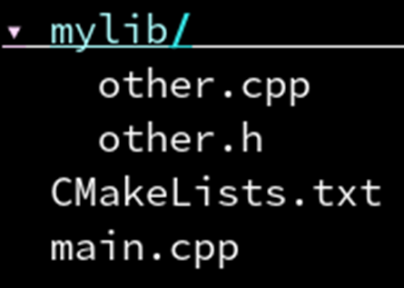

```cmake
add_executable(main)
file(GLOB sources CONFIGURE_DEPENDS *.cpp *.h mylib/*.cpp mylib/*.h)	#必须把路径名和后缀名的排列组合全部写出来吗？感觉好麻烦
target_sources(main public ${sources})
```

**大可不必！用aux_source_directory，自动搜集需要的文件后缀名**

```cmake
add_executable(main)
aux_source_directory(. sources)
aux_source_directory(mylib sources)
target_sources(main public ${sources})
```

**进一步：GLOB_RECURSE 了解一下！能自动包含所有子文件夹下的文件**

```cmake
add_executable(main)
file(GLOB_RECURSE sources CONFIGURE_DEPENDS *.cpp *.h)
target_sources(main public ${sources})
```

> **GLOB_RECURSE 的问题：会把 build 目录里生成的临时 .cpp 文件也加进来**
>
> *解决方案*：要么把源码统一放到 src 目录下，要么要求使用者不要把 build 放到和源码同一个目录里，我个人的建议是把源码放到 src 目录下。

## 项目配置变量

**CMAKE_BUILD_TYPE** **构建的类型，调试模式还是发布模式**

- CMAKE_BUILD_TYPE 是 CMake 中一个特殊的变量，用于控制构建类型，他的值可以是：
  - Debug 调试模式，完全不优化，生成调试信息，方便调试程序
  - Release 发布模式，优化程度最高，性能最佳，但是编译比 Debug 慢
  - MinSizeRel 最小体积发布，生成的文件比 Release 更小，不完全优化，减少二进制体积
  - RelWithDebInfo 带调试信息发布，生成的文件比 Release 更大，因为带有调试的符号信息
  - 默认情况下 CMAKE_BUILD_TYPE 为空字符串，这时相当于 Debug

```cmake
set(CMAKE_BUILD_TYPE Release)
```

**各种构建模式在编译器选项上的区别**

在Release模式下，追求的是程序的最佳性能表现，在此情况下，编译器会对程序做最大的代码优化以达到最快运行速度。另一方面，由于代码优化后不与源代码一致，此模式下一般会丢失大量的调试信息。

```text
1. Debug: `-O0 -g`
2. Release: `-O3 -DNDEBUG`
3. MinSizeRel: `-Os -DNDEBUG`
4. RelWithDebInfo: `-O2 -g -DNDEBUG`
```

> 此外，注意定义了 NDEBUG 宏会使 assert 被去除掉。

**小技巧：设定一个变量的默认值**

如何让 CMAKE_BUILD_TYPE 在用户没有指定的时候为 Release，指定的时候保持用户指定的值不变呢。

就是说 CMake 默认情况下 CMAKE_BUILD_TYPE 是一个空字符串。

因此这里通过 if (NOT CMAKE_BUILD_TYPE) 判断是否为空，如果空则自动设为 Release 模式。

大多数 CMakeLists.txt 的开头都会有这样三行，为的是让默认的构建类型为发布模式（高度优化）而不是默认的调试模式（不会优化）。

*我们稍后会详细捋一遍类似于 CMAKE_BUILD_TYPE 这样的东西。绝大多数 CMakeLists.txt 开头都会有的部分，可以说是“标准模板”了。*

```cmake
if(NOT CMAKE_BUILD_TYPE)
	set(CMAKE_BUILD_TYPE Release)
endif()
```

**project：初始化项目信息，并把当前 CMakeLists.txt 所在位置作为根目录**

> 这里初始化了一个名称为 hellocmake 的项目，为什么需要项目名？
>
> 对于 MSVC，他会在 build 里生成 hellocmake.sln 作为“IDE 眼中的项目”。

```cmake
cmake_minimum_required(VERSION 3.15)
project(hellocmake)

message("PROJECT_NAME: ${PROJECT_NAME}")
message("PROJECT_SOURCE_DIR: ${PROJECT_SOURCE_DIR}")
message("PROJECT_BINARY_DIR: ${PROJECT_BINARY_DIR}")
message("PROJECT_CURRENT_SOURCE_DIR: ${PROJECT_CURRENT_SOURCE_DIR}")
message("PROJECT_CURRENT_BINARY_DIR: ${PROJECT_CURRENT_BINARY_DIR}")
add_executable(main main.cpp)
```

> CMAKE_CURRENT_SOURCE_DIR 表示当前源码目录的位置，例如 ~/hellocmake。
>
> CMAKE_CURRENT_BINARY_DIR 表示当前输出目录的位置，例如 ~/hellocmake/build

**project：初始化项目信息，并把当前 CMakeLists.txt 所在位置作为根目录**

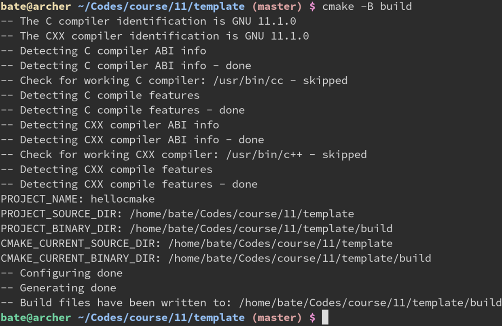

**和子模块的关系：PROJECT_x_DIR 和 CMAKE_CURRENT_x_DIR 的区别**

PROJECT_SOURCE_DIR 表示最近一次调用 project 的 CMakeLists.txt 所在的源码目录。

CMAKE_CURRENT_SOURCE_DIR 表示当前 CMakeLists.txt 所在的源码目录。

CMAKE_SOURCE_DIR 表示最为外层 CMakeLists.txt 的源码根目录。

利用 PROJECT_SOURCE_DIR 可以实现从子模块里直接获得项目最外层目录的路径。

不建议用 CMAKE_SOURCE_DIR，那样会让你的项目无法被人作为子模块使用。

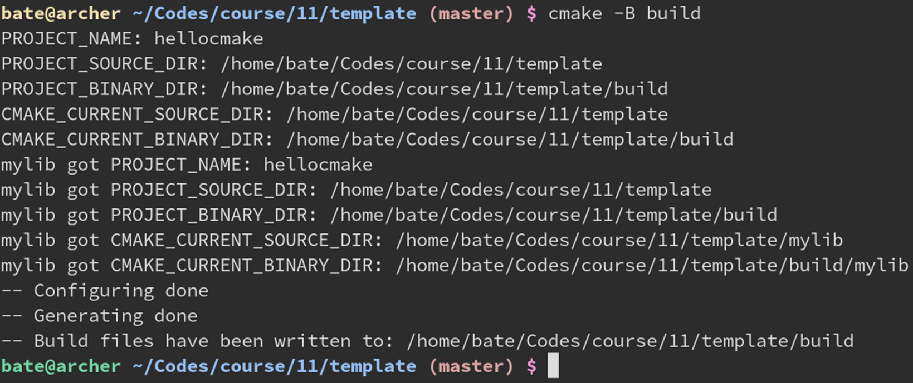

**其他相关变量**

- PROJECT_SOURCE_DIR：当前项目源码路径（存放main.cpp的地方）

- PROJECT_BINARY_DIR：当前项目输出路径（存放main.exe的地方）

- CMAKE_SOURCE_DIR：根项目源码路径（存放main.cpp的地方）

- CMAKE_BINARY_DIR：根项目输出路径（存放main.exe的地方）

- PROJECT_IS_TOP_LEVEL：BOOL类型，表示当前项目是否是（最顶层的）根项目

- PROJECT_NAME：当前项目名

- CMAKE_PROJECT_NAME：根项目的项目名

•详见：https://cmake.org/cmake/help/latest/command/project.html

**子模块里也可以用 project 命令，将当前目录作为一个独立的子项目**

这样一来 PROJECT_SOURCE_DIR 就会是子模块的源码目录而不是外层了。

这时候 CMake 会认为这个子模块是个独立的项目，会额外做一些初始化。

他的构建目录 PROJECT_BINARY_DIR 也会变成 build/<源码相对路径>。

这样在 MSVC 上也会看见 build/mylib/mylib.vcxproj 的生成。

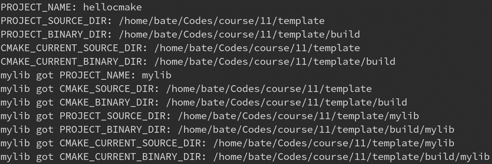

**project 的初始化：LANGUAGES 字段**

- project(项目名 LANGUAGES 使用的语言列表...)  指定了该项目使用了哪些编程语言。
- 目前支持的语言包括：
  - C：C语言
  - CXX：C++语言
  - ASM：汇编语言
  - Fortran：老年人的编程语言
  - CUDA：英伟达的 CUDA（3.8 版本新增）
  - OBJC：苹果的 Objective-C（3.16 版本新增）
  - OBJCXX：苹果的 Objective-C++（3.16 版本新增）
  - ISPC：一种因特尔的自动 SIMD 编程语言（3.18 版本新增）
  - 如果不指定 LANGUAGES，默认为 C 和 CXX

```cmake
# 常见问题：LANGUAGES 中没有启用 C 语言，但是却用到了 C 语言
# 解决：改成 project(项目名 LANGUAGES C CXX) 即可
cmake_minimum_required(VERSION 3.15)
project(hellocmake LANGUAGES C CXX)

add_executable(main main.cpp other.h other.c)
```

也可以先设置 LANGUAGES NONE，之后再调用 enable_language(CXX)

```cmake
cmake_minimum_required(VERSION 3.15)
project(hellocmake LANGUAGES NONE)
enable_language(CXX)

add_executable(main main.cpp)
```

**设置 C++ 标准：CMAKE_CXX_STANDARD 变量**

- CMAKE_CXX_STANDARD是一个整数，表示要用的 C++ 标准。
- 比如需要 C++17 那就设为 17，需要 C++23 就设为 23。
- CMAKE_CXX_STANDARD_REQUIRED 是 BOOL 类型，可以为 ON 或 OFF，默认 OFF。
- 他表示是否一定要支持你指定的 C++ 标准：如果为 OFF 则 CMake 检测到编译器不支持 C++17 时不报错，而是默默调低到 C++14 给你用；为 ON 则发现不支持报错，更安全。
- CMAKE_CXX_EXTENSIONS 也是 BOOL 类型，默认为 ON。设为 ON 表示启用 GCC 特有的一些扩展功能；OFF 则关闭 GCC 的扩展功能，只使用标准的 C++。
- 要兼容其他编译器（如 MSVC）的项目，都会设为 OFF 防止不小心用了 GCC 才有的特性。
- 此外，最好是在 project 指令前设置 CMAKE_CXX_STANDARD 这一系列变量，这样 CMake 可以在 project 函数里对编译器进行一些检测，看看他能不能支持 C++17 的特性。

```cmake
cmake_minimum_required(VERSION 3.15)

set(CMAKE_CXX_STANDARD 17)
set(CMAKE_CXX_STANDARD_REQURED ON)
set(CMAKE_CXX_EXTENSIONS ON)

project(hellocmake LANGUAGES CXX)
```

**常见误区：我手动添加 -std=c++17 行不行？**

- 请勿直接修改 CMAKE_CXX_FLAGS 来添加 -std=c++17（你在百度 CSDN 学到的用法）。
- 请使用 CMake 帮你封装好的 CMAKE_CXX_STANDARD（从业人员告诉你的正确用法）。
- 为什么百度不对：你 GCC 用户手动指定了 -std=c++17，让 MSVC 的用户怎么办？
- 此外 CMake 已经自动根据 CMAKE_CXX_STANDARD 的默认值 11 添加 -std=c++11 选项了，你再添加个 -std=c++17 选项不就冲突了吗？所以请用 CMAKE_CXX_STANDARD。

**project 的初始化：VERSION 字段**

- project(项目名 VERSION x.y.z) 可以把当前项目的版本号设定为 x.y.z。
- 之后可以通过 PROJECT_VERSION来获取当前项目的版本号。
- PROJECT_VERSION_MAJOR获取 x（主版本号）。
- PROJECT_VERSION_MINOR获取 y（次版本号）。
- PROJECT_VERSION_PATCH获取 z（补丁版本号）。

```cmake
cmake_minimum_required(VERSION 3.15)

project(hellocmake VERSION 0.2.3)
message("PROJECT_NAME: ${PROJECT_NAME}")
message("PROJECT_VERSION: ${PROJECT_VERSION}")
message("PROJECT_VERSION_MAJOR: ${PROJECT_VERSION_MAJOR}")
message("PROJECT_VERSION_MINOR: ${PROJECT_VERSION_MINOR}")
message("PROJECT_VERSION_PATCH: ${PROJECT_VERSION_PATCH}")
```

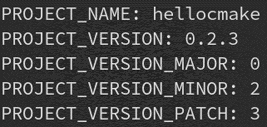

**一些没什么用，但 CMake 官方不知为何就是提供了的项目字段……**

```cmake
cmake_minimum_required(VERSION 3.15)

project(hellocmake
	DESCRIPTION "A free, open-source, online modern C++ course"
	HOMEPAGE_URL https://github.com/xxx/xxx
)
message("PROJECT_NAME: ${PROJECT_NAME}")
message("PROJECT_VERSION: ${PROJECT_VERSION}")
message("PROJECT_DESCRIPTION: ${PROJECT_DESCRIPTION}")
message("PROJECT_HOMEPAGE_URL: ${PROJECT_HOMEPAGE_URL}")
```

**项目名的另一大作用：会设置另外 <项目名>_SOURCE_DIR 等变量**

```cmake
cmake_minimum_required(VERSION 3.15)

project(hellocmake VERSION 0.2.3)
message("PROJECT_NAME: ${PROJECT_NAME}")
message("PROJECT_VERSION: ${PROJECT_VERSION}")
message("PROJECT_SOURCE_DIR: ${PROJECT_SOURCE_DIR}")
message("PROJECT_BINARY_DIR: ${PROJECT_BINARY_DIR}")
message("hellocmake_VERSION: ${hellocmake_VERSION}")
message("hellocmake_SOURCE_DIR: ${hellocmake_SOURCE_DIR}")
message("hellocmake_BINARY_DIR: ${hellocmake_BINARY_DIR}")
add_executable(main main.cpp)
```

**小技巧：CMake 的 ${} 表达式可以嵌套**

因为 ${PROJECT_NAME} 求值的结果是 hellocmake
所以 ${${PROJECT_NAME}_VERSION} 相当于 ${hellocmake_VERSION}
进一步求值的结果也就是刚刚指定的 0.2.3 了。

```cmake
cmake_minimum_required(VERSION 3.15)

project(hellocmake VERSION 0.2.3)
message("PROJECT_NAME: ${PROJECT_NAME}")
message("PROJECT_VERSION: ${PROJECT_VERSION}")
message("PROJECT_SOURCE_DIR: ${PROJECT_SOURCE_DIR}")
message("PROJECT_BINARY_DIR: ${PROJECT_BINARY_DIR}")
message("hellocmake_VERSION: ${hellocmake_VERSION}")
message("hellocmake_SOURCE_DIR: ${hellocmake_SOURCE_DIR}")
message("hellocmake_BINARY_DIR: ${hellocmake_BINARY_DIR}")
message("hellocmake_VERSION: ${${PROJECT_NAME}_VERSION}")
message("hellocmake_SOURCE_DIR: ${${PROJECT_NAME}_SOURCE_DIR}")
message("hellocmake_BINARY_DIR: ${${PROJECT_NAME}_BINARY_DIR}")
add_executable(main main.cpp)
```

**cmake_minimum_required 指定最低所需的 CMake 版本**

假如你写的 CMakeLists.txt 包含了 3.15 版本才有的特性，
如果用户在老版本上使用，就会出现各种奇怪的错误。
因此最好在第一行加个 cmake_minimum_required(VERSION 3.15)
表示本 CMakeLists.txt 至少需要 CMake 版本 3.15 以上才能运行。
如果用户的 CMake 版本小于 3.15，会出现“CMake 版本不足”的提示。

```cmake
cmake_minimum_required(VERSION 3.15)
```

**可以通过** **cmake --version** **查看当前版本**

```shell
-> % cmake -version
cmake version 3.25.2

CMake suite maintained and supported by Kitware (kitware.com/cmake).
```

也可以通过 CMAKE_VERSION这个变量来获得当前 CMake 版本号。
CMAKE_MINIMUM_REQUIRED_VERSION获取 cmake_minimum_required
中指定的“最小所需版本号”。

```cmake
cmake_minimum_required(VERSION 3.15)

project(hellocmake VERSION 0.2.3)
message("PROJECT_NAME: ${PROJECT_NAME}")
message("CMAKE_VERSION: ${CMAKE_VERSION}")
message("CMAKE_MINIMUM_REQUIRED_VERSION: ${CMAKE_MINIMUM_REQUIRED_VERSION}")
add_executable(main main.cpp)
```

**注意：cmake_minimum_required不仅是“最小所需版本”**

虽然名字叫 minimum_required，实际上不光是 >= 3.15 就不出错这么简单。
根据你指定的不同的版本号，还会决定接下来一系列 CMake 指令的行为。
此外，你还可以通过 3.15...3.20 来表示最高版本不超过 3.20。
这会对 cmake_policy 有所影响，稍后再提。

**CMake常见变量——Project和CMake相关信息**

**https://blog.csdn.net/fuyajun01/article/details/8891749**

**一个标准的 CMakeLists.txt 模板**

```cmake
cmake_minimum_required(VERSION 3.15)

set(CMAKE_CXX_STANDARD 17)
set(CMAKE_CXX_STANDARD_REQUIRED ON)

project(zeno LANGUAGES C CXX)

# 源和生成在一个路径警告
if (PROJECT_BINARY_DIR STREQUAL PROJECT_SOURCE_DIR)
	message(WARNING "the binary directory of CMake cannot be the same as source directory!")
endif()

if (NOT CMAKE_BUILD_TYPE)
	set(CMAKE_BUILD_TYPE Release)
endif()

# windows bug，windows.h 会定义宏影响std::min std::max
if (WIN32)
	add_definition(-DNOMINMAX -D_USE_MATH_DEFINES)
endif()

# 编译带缓存，加快速度
if (NOT MSVC)
	find_program(CCACHE_PROGRAM ccache)
	if (CCACHE_PROGRAM)
		message(STATUS "Found CCache: ${CCACHE_PROGRAM}")
		set_property(GLOBAL PROPERTY RULE_LAUNCH_COMPILE ${CCACHE_PROGRAM})
		set_property(GLOBAL PROPERTY RULE_LAUNCH_LINK ${CCACHE_PROGRAM})
	endif()
endif()
```

## 链接库文件

### mylib 作为一个静态库

```cmake
add_library(mylib STATIC mylib.cpp)

add_excutable(main main.cpp)

target_link_libraries(main PUBLIC mylib)
```

### mylib 作为一个对象库

```cmake
add_library(mylib SHARED mylib.cpp)

add_excutable(main main.cpp)

target_link_libraries(main PUBLIC mylib)
```

### mylib 作为一个对象库

> 对象库类似于静态库，但不生成 .a 文件，只由 CMake 记住该库生成了哪些对象文件
>
> 对象库类似于静态库，但不生成 .a 文件，只由 CMake 记住该库生成了哪些对象文件
> 对象库是 CMake 自创的，绕开了编译器和操作系统的各种繁琐规则，保证了跨平台统一性。
> 在自己的项目中，我推荐全部用对象库(OBJECT)替代静态库(STATIC)避免跨平台的麻烦。
> 对象库仅仅作为组织代码的方式，而实际生成的可执行文件只有一个，减轻了部署的困难。

```cmake
add_library(mylib OBJECT mylib.cpp)

add_excutable(main main.cpp)

target_link_libraries(main PUBLIC mylib)
```

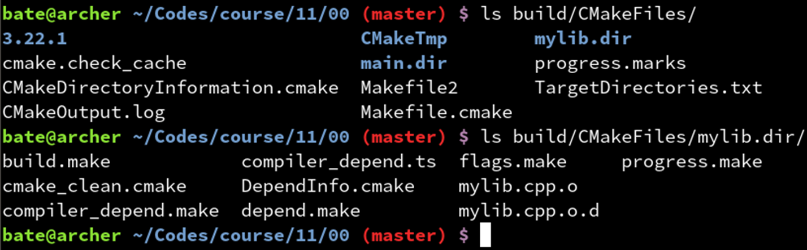

静态库的麻烦：GCC 编译器会自动剔除没有引用符号的那些对象，对象库可以绕开编译器的不统一：保证不会自动剔除没引用到的对象文件，虽然动态库也可以避免剔除没引用的对象文件，但引入了运行时链接的麻烦。

**add_library 无参数时，是静态库还是动态库？**

会根据 BUILD_SHARED_LIBS 这个变量的值决定是动态库还是静态库。
ON 则相当于 SHARED，OFF 则相当于 STATIC。
如果未指定 BUILD_SHARED_LIBS 变量，则**默认为 STATIC**。
因此，如果发现一个项目里的 add_library 都是无参数的，意味着你可以用：
cmake -B build -DBUILD_SHARED_LIBS:BOOL=ON
来让他全部生成为动态库。稍后会详解命令行传递变量的规则。

```cmake
set(BUILD_SHARED_LIBS ON)  #默认情况下是OFF，也就是静态库

add_library(mylib mylib.cpp)
```

*小技巧：设定一个变量的默认值*

要让 BUILD_SHARED_LIBS 默认为 ON，可以用下图这个方法：
如果该变量没有定义，则设为 ON，否则保持用户指定的值不变。
这样当用户没有指定 BUILD_SHARED_LIBS 这个变量时，会默认变成 ON。
也就是说除非用户指定了 -DBUILD_SHARED_LIBS:BOOL=OFF 才会生成静态库，否则默认是生成动态库。

```cmake
if (NOT DEFINED BUILD_SHARED_LIBS)
	set(BUILD_SHARED_LIBS ON)
endif
```

**常见坑点：动态库无法链接静态库**

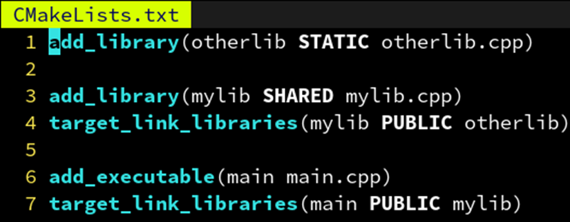

```cmake
add_library(otherlib STATIC otherlib.cpp)

add_library(mylib SHARED mylib.cpp)
target_link_libraries(mylib PUBLIC otherlib)

add_executable(main main.cpp)
target_link_libraries(main PUBLIC mylib)
```

解决：让静态库编译时也生成位置无关的代码(PIC)，这样才能装在动态库里

```cmake
set(CMAKE_POSITION_INDEPENDENT_CODE ON)

add_library(otherlib STATIC otherlib.cpp)

add_library(mylib SHARED mylib.cpp)
target_link_libraries(mylib PUBLIC otherlib)

add_executable(main main.cpp)
target_link_libraries(main PUBLIC mylib)
```

也可以只针对一个库，只对他启用位置无关的代码(PIC)

```cmake
set(CMAKE_POSITION_INDEPENDENT_CODE ON)
set_property(TARGET otherlib PROPERTY POSITION_INDEPENDENT_CODE ON})

add_library(otherlib STATIC otherlib.cpp)

add_library(mylib SHARED mylib.cpp)
target_link_libraries(mylib PUBLIC otherlib)

add_executable(main main.cpp)
target_link_libraries(main PUBLIC mylib)
```

## 对象的属性

除了 POSITION_INDEPENDENT_CODE 还有哪些这样的属性？

```cmake
add_executeble(main main.cpp)

set_property(TARGET main PROPERTY CXX_STANDARD 17)	# 采用 c++17 标准进行编译（默认11）
set_property(TARGET main PROPERTY CXX_STANDARD_REQUIRED ON)	# 如果编译器不支持 c++17，否则直接报错（默认 OFF）
set_property(TARGET main PROPERTY WIN32_EXECUTABLE ON)	# 在 Windows 系统中，运行时不启动控制台窗口，只有 GUI 界面（默认为OFF）
set_property(TARGET main PROPERTY LINK_WHAT_YOU_USE ON)	# 告诉编译器不要自动剔除没有引用符号的链接库（默认 OFF）
set_property(TARGET main PROPERTY LIBRARY_OUTPUT_DIRECTOY ${CMAKE_SOURCE_DIR}/lib)	# 设置动态链接库的输出路径（默认 ${CMAKE_BINARY_DIR}）
set_property(TARGET main PROPERTY ARCHIVE_OUTPUT_DIRECTOY ${CMAKE_SOURCE_DIR}/lib)	# 设置静态链接库的输出路径（默认 ${CMAKE_BINARY_DIR}）
set_property(TARGET main PROPERTY RUNTIME_OUTPUT_DIRECTOY ${CMAKE_SOURCE_DIR}/lib)	# 设置可执行文件的输出路径（默认 ${CMAKE_BINARY_DIR}）
```

另一种方式：set_target_properties 批量设置多个属性

```cmake
add_executeble(main main.cpp)

set_target_properties(main PROPERTIES
	CXX_STANDARD 17	# 采用 c++17 标准进行编译（默认11）
	PROPERTY CXX_STANDARD_REQUIRED ON	# 如果编译器不支持 c++17，否则直接报错（默认 OFF）
	WIN32_EXECUTABLE ON	# 在 Windows 系统中，运行时不启动控制台窗口，只有 GUI 界面（默认为OFF）
	LINK_WHAT_YOU_USE ON	# 告诉编译器不要自动剔除没有引用符号的链接库（默认 OFF）
	LIBRARY_OUTPUT_DIRECTOY ${CMAKE_SOURCE_DIR}/lib	# 设置动态链接库的输出路径（默认 ${CMAKE_BINARY_DIR}）
	ARCHIVE_OUTPUT_DIRECTOY ${CMAKE_SOURCE_DIR}/lib	# 设置静态链接库的输出路径（默认 ${CMAKE_BINARY_DIR}）
	RUNTIME_OUTPUT_DIRECTOY ${CMAKE_SOURCE_DIR}/lib	# 设置可执行文件的输出路径（默认 ${CMAKE_BINARY_DIR}）
)
```

另一种方式：通过全局的变量，让之后创建的所有对象都享有同样的属性

> 相当于改变了各个属性的初始默认值。
> 要注意此时 set(CMAKE_xxx) 必须在 add_executable 之前才有效。

```cmake
set(CXX_STANDARD 17)	# 采用 c++17 标准进行编译（默认11）
set(PROPERTY CXX_STANDARD_REQUIRED ON)	# 如果编译器不支持 c++17，否则直接报错（默认 OFF）
set(WIN32_EXECUTABLE ON)	# 在 Windows 系统中，运行时不启动控制台窗口，只有 GUI 界面（默认为OFF）
set(LINK_WHAT_YOU_USE ON)	# 告诉编译器不要自动剔除没有引用符号的链接库（默认 OFF）
set(LIBRARY_OUTPUT_DIRECTOY ${CMAKE_SOURCE_DIR}/lib)	# 设置动态链接库的输出路径（默认 ${CMAKE_BINARY_DIR}）
set(ARCHIVE_OUTPUT_DIRECTOY ${CMAKE_SOURCE_DIR}/lib)	# 设置静态链接库的输出路径（默认 ${CMAKE_BINARY_DIR}）
set(RUNTIME_OUTPUT_DIRECTOY ${CMAKE_SOURCE_DIR}/lib)	# 设置可执行文件的输出路径（默认 ${CMAKE_BINARY_DIR}）

add_executeble(main main.cpp)
```

如果你从网上学的 CMake，你可能会犯如下的错误

对于 CXX_STANDARD 这种 CMake 本就提供了变量来设置的东西，就不要自己去设置 -std=c++17 选项，会和 CMake 自己设置好的冲突，导致出错。
请始终用 CXX_STANDARD 或是全局变量 CMAKE_CXX_STANDARD 来设置 -std=c++17 这个 flag，CMake 会在配置阶段检测编译器是否支持 C++17。
CUDA 的 -arch=sm_75 也是同理，请使用`UDA_ARCHITECTURES`属性。
再说了 -std=c++17 只是 GCC 编译器的选项，无法跨平台用于 MSVC 编译器。

```cmake
add_executeble(main main.cpp)

set_property(TARGET main PROPERTY CXX_STANDARD 17)	# 正确
target_compile_options(main PUBLIC "-std=c++17")	# 错误
set_property(TARGET main PROPERTY CUDA_ARCHITECTURES 75)	# 正确
target_compile_options(main PUBLIC "-arch=sm_75")	# 错误
```

假如你一定要用动态链接库（Windows 对动态链接很不友好）

mylib.cpp

```c++
#include <cstdio>

#ifdef _MSC_VER
__declspec(dllexport)
#endif

void say_hello() {
    printf("Hello world!"\n);
}
```

mylib.h

```c++
#pragma once

#ifdef _MSC_VER
__declspec(dllexport)
#endif

void say_hello();
```

CMakeList.txt

```cmake
cmake_minimum_required(VERSION 3.15)

add_subdirectory(mylib)

add_executable(main main.cpp)
target_link_libraries(main PUBLIC mylib)
```

```cmake
add_library(mylib SHARED mylib.cpp mylib.h)
```

**常见问题：老师，我链接了自己的 dll，但是为什么运行时会找不到？**

- 这是因为你的 dll 和 exe 不在同一目录。Windows 比较蠢，他只会找当前 exe 所在目录，然后查找 PATH，找不到就报错。而你的 dll 在其他目录，因此 Windows 会找不到 dll。
- 解决1：把 dll 所在位置加到你的 PATH 环境变量里去，一劳永逸。
- 解决2：把这个 dll，以及这个 dll 所依赖的其他 dll，全部拷贝到和 exe 文件同一目录下。

**手动拷贝 dll 好麻烦，能不能让 CMake 把 dll 自动生成在 exe 同一目录？**

- 归根到底还是因为 CMake 把定义在顶层模块里的 main 放在 build/main.exe。
- 而 mylib 因为是定义在 mylib 这个子模块里的，因此被放到了 build/mylib/mylib.dll。

**解决1：设置 mylib 对象的 xx_OUTPUT_DIRECTORY 系列属性**

- 所以，可以设置 mylib 的这些属性，让 mylib.dll 文件输出到 PROJECT_BINARY_DIR，也就是项目根目录（main 所在的位置）。这样 main.exe 在运行时就能找到 mylib.dll 了。
- 是的，为了伺候这睿智的 Windows 系统，需要设置全部 6 个属性，是不是非常繁琐？

```cmake
add_library(mylib SHARED mylib.cpp mylib.h)

set_property(TARGET mylib PROPERTY RUNTIME_OUTPUT_DIRECTOY ${PROJECT_SOURCE_DIR}/lib)
set_property(TARGET mylib PROPERTY ARCHIVE_OUTPUT_DIRECTOY ${PROJECT_SOURCE_DIR}/lib)
set_property(TARGET mylib PROPERTY LIBRARY_OUTPUT_DIRECTOY ${PROJECT_SOURCE_DIR}/lib)

set_property(TARGET mylib PROPERTY RUNTIME_OUTPUT_DIRECTOY_DEBUG ${PROJECT_SOURCE_DIR}/lib)
set_property(TARGET mylib PROPERTY ARCHIVE_OUTPUT_DIRECTOY_DEBUG ${PROJECT_SOURCE_DIR}/lib)
set_property(TARGET mylib PROPERTY LIBRARY_OUTPUT_DIRECTOY_DEBUG ${PROJECT_SOURCE_DIR}/lib)

set_property(TARGET mylib PROPERTY RUNTIME_OUTPUT_DIRECTOY_RELEASE ${PROJECT_SOURCE_DIR}/lib)
set_property(TARGET mylib PROPERTY ARCHIVE_OUTPUT_DIRECTOY_RELEASE ${PROJECT_SOURCE_DIR}/lib)
set_property(TARGET mylib PROPERTY LIBRARY_OUTPUT_DIRECTOY_RELEASE ${PROJECT_SOURCE_DIR}/lib)
```

**不懂就问，为什么说 Linux 系统是永远滴神？**

- 而 Linux 系统支持 RPATH，CMake 会让生成出来可执行文件的 RPATH 字段指向他链接了的 .so 文件所在目录，运行时会优先从 RPATH 里找链接库，所以即使不在同目录也能找到。
- 所以还有第三种解决方案：微软，我卸卸你全家（指卸载）。然后安装 Arch Linux 系统。
- 需要手动修改或查看一个 ELF 文件的 RPATH，可以用 chrpath 或 patchelf 命令。

## 链接第三方库

**案例：需要使用 tbb 这个库**

```cmake
add_executable(main main.cpp)
target_link_libraries(main PUBLIC tbb) 
```

**直接链接 tbb 的缺点**

如果这样直接指定 tbb，CMake 会让链接器在系统的库目录里查找 tbb，他会找到 /usr/lib/libtbb.so 这个系统自带的，但这对于没有一个固定库安装位置的Windows 系统并不适用。
此外，他还要求 tbb 的头文件就在 /usr/include 这个系统默认的头文件目录，这样才能 #include <tbb/parallel_for.h> 不出错，如果 tbb 的头文件在其他地方就需要再加一个 target_include_directories 设置额外的头文件查找目录。

**也可以直接写出全部路径，就是太硬核**

也可以直接写出全部路径，这样也可以让没有默认系统路径的 Windows 找到安装在奇怪位置的 tbb……不过这样根本不跨平台，你这样改了别人如果装在不同地方就出错了。
顺便一提，CMake 的路径分割符始终是 /。即使在 Windows 上，也要把所有的 \ 改成 /，这是出于跨平台的考虑。请放心，CMake 会自动在调用 MSVC 的时候转换成 \，你可以放心的用 ${x}/bin 来实现和 Python 的 os.path.join(x, ‘bin’) 一样的效果。

```cmake
add_executable(main main.cpp)
target_link_libraries(main PUBLIC C:/Users/hokori/installed/tbb/tbb.dll)
```

这种情况基本上换个电脑就不能用了

**更通用的方式：find_package**

更好的做法是用 CMake 的 find_package 命令。
find_package(TBB REQUIRED) 会查找 /usr/lib/cmake/TBB/TBBConfig.cmake 这个配置文件，并根据里面的配置信息创建 TBB::tbb 这个伪对象（他实际指向真正的 tbb 库文件路径 /usr/lib/libtbb.so），之后通过 target_link_libraries 链接 TBB::tbb 就可以正常工作了。

```cmake
add_executable(main main.cpp)

find_package(TBB REQUIRED)
target_link_libraries(main PUBLIC TBB::tbb)
```

**TBB::tbb 的秘密：自带了一些 PUBLIC 属性**

TBB::tbb 是一个伪对象(imported)，除了他会指向 /usr/lib/libtbb.so 之外，TBBConfig.cmake 还会给 TBB::tbb 添加一些 PUBLIC 属性，用于让链接了他的对象带上一些 flag 之类的。
比如，TBB 安装在 /opt/tbb 目录下，头文件在 /opt/tbb/include 里，那么这时 TBBConfig.cmake 里就会有：
target_include_directories(TBB::tbb PUBLIC /opt/tbb/include)
这样 main 在链接了 TBB::tbb 的时候也会被“传染”上 /opt/tbb/include 这个目录，不用调用者手动添加了。
再比如，TBB::tbb 链接了另一个库 Blosc::blosc，那这个库也会自动链接到 main 上，无需调用者手动添加。
比如 spdlog 的 spdlog-config.cmake 就会定义 SPDLOG_NOT_HEADER_ONLY 这个宏为 PUBLIC。从而实现直接 #include <spdlog/spdlog.h> 时候是纯头文件，而 find_package(spdlog REQUIRED) 时却变成预编译链接库的版本。（嗯，其实不是 PUBLIC 而是 INTERFACE，因为伪对象没有实体）

**和古代 CMake 做对比：为什么 PUBLIC 属性的传播机制如此便利**

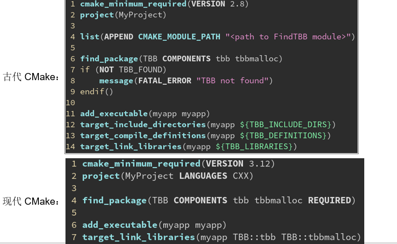

**和 find_package(TBB CONFIG REQUIRED) 有什么区别？**

其实更好的是通过 find_package(TBB CONFIG REQUIRED)，添加了一个 CONFIG 选项。这样他会优先查找 TBBConfig.cmake（系统自带的）而不是 FindTBB.cmake（项目作者常把他塞在 cmake/ 目录里并添加到 CMAKE_MODULE_PATH）。这样能保证寻找包的这个 .cmake 脚本是和系统自带的 tbb 版本是适配的，而不是项目作者当年下载的那个版本的 .cmake 脚本。

```cmake
add_executable(main main.cpp)

find_package(TBB CONFIG REQUIRED)
target_link_libraries(main PUBLIC TBB::tbb)
```

> 当然，如果你坚持要用 find_package(TBB REQUIRED) 也是可以的。
> 没有 CONFIG 选项：先找 FindTBB.cmake，再找 TBBConfig.cmake，找不到则报错
> 有 CONFIG 选项：只会找 TBBConfig.cmake，找不到则报错
> 此外，一些老年项目（例如 OpenVDB）只提供 Find 而没有 Config 文件，这时候就必须
> 用 find_package(OpenVDB REQUIRED) 而不能带 CONFIG 选项。

**老年项目案例：OpenVDB（反面教材）**

一些老年项目作者喜欢在项目里自己塞几个 FindXXX.cmake，然而版本可能和系统里的不一样，比如用 3.0 的 finder 去找 2.0 的包，容易出现一些奇奇怪怪的错误。
不建议大家这样用自己创建一个 cmake/ 目录来存用到的所有库的 finder，尽量用系统自带的，可以保证用的是系统自带库的那个配置。

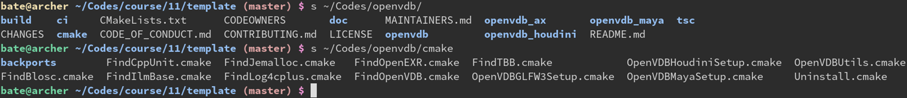

**find_package(Qt5 REQUIRED) 出错了**

```cmake
find_package(Qt5 REQUIRED)
target_link_libraries(main PUBLIC Qt5::Widgets Qt5::Gui)
```

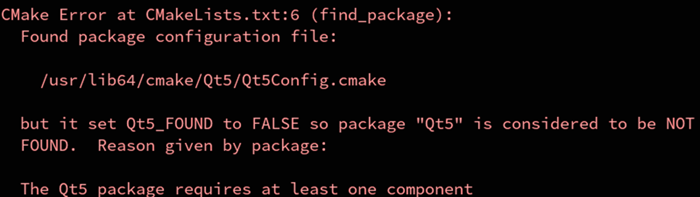

原因：Qt5 具有多个组件，必须指定你需要哪些组件

find_package 生成的伪对象(imported target)都按照“包名::组件名”的格式命名。
你可以在 find_package 中通过 COMPONENTS 选项，后面跟随一个列表表示需要用的组件。

```cmake
find_package(Qt5 COMPONENTS Widgets Gui REQUIRED)
target_link_libraries(main PUBLIC Qt5::Widgets Qt5::Gui)
```

**常见问题：小彭老师，Windows 上找不到 Qt5 包怎么办？我明明安装了！**

你是 Windows 系统，可能你安装了 Qt5，但是因为 Windows 系统的安装路径非常混乱，
没有固定的 /usr/lib 之类的默认路径可以搜索，所以出错了。

**常见问题：小彭老师，Windows 上找不到 Qt5 包怎么办？我明明安装了！**

- 假设你的 Qt5 安装在 C:\Qt\Qt5.14.2，则你去找找这个目录：
  - C:\Qt\Qt5.14.2\msvc2019_64\lib\cmake\
- 你会看到他里面有个 Qt5Config.cmake 对吧。现在，有四种方法让 CMake 找得到他。
- 第一种是设置 CMAKE_MODULE_PATH 变量，添加一下包含 Qt5Config.cmake 这个文件的目录路径 `C:\Qt\Qt5.14.2\msvc2019_64\lib\cmake`，当然刚刚说了尽管你是 Windows 还是要把 `\` 全部换成 `/`，因为 CMake 是“亲 Unix”的构建系统。
- 是的，学个编程跟隔壁史地政一样，有地缘因素在里边……

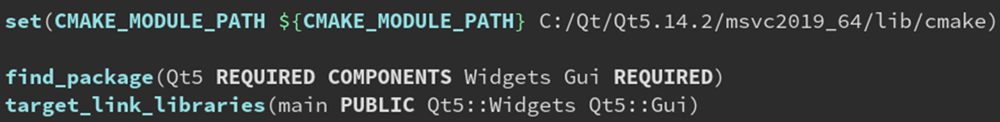

更好的方法：设置 <包名>_DIR 变量指向 <包名>Config.cmake 所在位置

- 第二种是设置 Qt5_DIR 这个变量为 C:\Qt\Qt5.14.2\msvc2019_64\lib\cmake。

- 这样只有 Qt5 这个包会去这个目录里搜索 Qt5Config.cmake，更有针对性。

  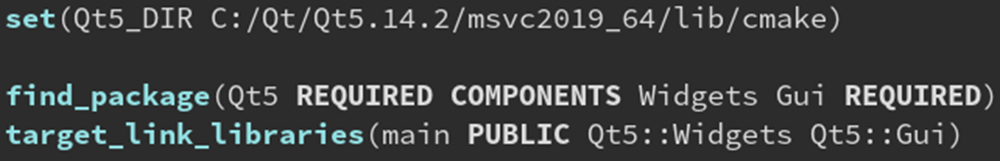

- 第三种(推荐)，直接在命令行通过 -DQt5_DIR=”xxx” 指定，这样不用修改 CMakeLists.txt。

  

- 第四种，还可以通过设置环境变量 Qt5_DIR 也是可以的，就是对 Windows 用户比较困难。

  

**不指定 REQUIRED，找不到时不报错，只会设置 TBB_FOUND 为 FALSE**

```cmake
find_package(TBB)
## if (TBB_FOUND)
if (TARGET TBB::tbb)	# 也可以用 TARGET 判断是否存在 TBB::tbb 这个伪对象，实现同样效果
	message(STATUS "TBB found at: ${TBB_DIR}")
	target_link_libraries(main PUBLIC TBB::tbb)
	target_link_definitions(main PUBLIC WITH_TBB)
else()
	message(WARNING "TBB not found! using serial for")
endif()
```

如果没有 REQUIRED 选项，找不到时将不会报错。
这样可以用于添加一些可选的依赖，如果没有也不要紧的那种，这时我们可以抛出一个警告。
找到了会把 TBB_FOUND 设为 TRUE，TBB_DIR 设为 TBBConfig.cmake 所在路径。
找不到会把 TBB_FOUND 设为 FALSE，TBB_DIR 为空。
这里我们在找到 TBB 时定义 WITH_TBB 宏，稍后 .cpp 里就可以根据这个判断。
如果找不到 TBB 可以 fallback 到保守的实现。

## 输出与变量

在运行 cmake -B build 时，打印字符串（用于调试）

```cmake
message("Hello, world!")
```

message(STATUS “...”) 表示信息类型是状态信息，有 -- 前缀

```cmake
message(STATUS "Hello, world!")
```

message(WARNING “...”) 表示是警告信息

```cmake
message(STATUS "Hello, world!")
message(WARNING "This is a warning sign!")
```

message(AUTHOR_WARNING “...”) 表示是仅仅给项目作者看的警告信息

```cmake
message(STATUS "Hello, world!")
message(AUTHOR_WARNING "This is a warning sign!")
```

> AUTHOR_WARNING 的不同之处：可以通过 -Wno-dev 关闭

```shell
cmake -B build -Won-dev
```

message(FATAL_ERROR “...”) 表示是错误信息，会终止 CMake 的运行

```cmake
message(STATUS "Hello, world!")
message(FATAL_ERROR "This is a error message!")
message(STATUS "After error ...")
```

message(SEND_ERROR “...”) 表示是错误信息，但之后的语句仍继续执行

```cmake
message(STATUS "Hello, world!")
message(SEND_ERROR "This is a error message!")
message(STATUS "After error ...")
```

message 可以用于打印变量

```cmake
set(myvar "Hello world")
message("myvar is: ${myvar}")
```

如果 set 没加引号会怎样？会变成分号分割的列表

set(myvar hello world)
其实等价于：
set(myvar “hello;world”)

```cmake
set(myvar hello world)
message("myvar is: ${myvar}")
```

如果 message 没加引号会怎样？会把列表里的字符串当成他的关键字

结论：除非确实需要列表，建议始终在你不确定的地方加上引号，例如：

```cmake
set(sources "main.cpp" "mylib.cpp" "C:/Program Files/a.cpp")
message("${sources}")
```

## 变量与缓存

**重复执行 cmake -B build 会有什么区别？**

可以看到第二次的输出少了很多，这是因为 CMake 第一遍需要检测编译器和 C++ 特性等比较耗时，检测完会把结果存储到缓存中，这样第二遍运行`cmake -B build`时就可以直接用缓存的值，就不需要再检测一遍了。

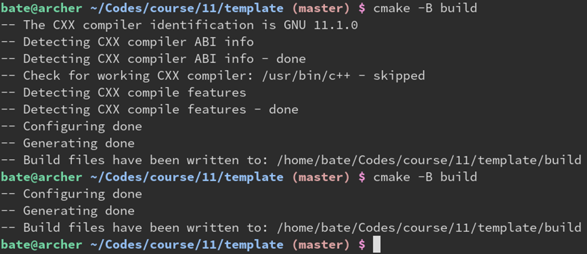

**如何清除缓存？删 build 大法了解一下**

然而有时候外部的情况有所更新，这时候 CMake 里缓存的却是旧的值，会导致一系列问题。
这时我们需要清除缓存，最简单的办法就是删除 build 文件夹，然后重新运行 cmake -B build。缓存是很多 CMake 出错的根源，因此如果出现诡异的错误，可以试试看删 build 全部重新构建。
经典 CMake 笑话：“99%的cmake错误可以用删build解决”“删 build 大法好”。

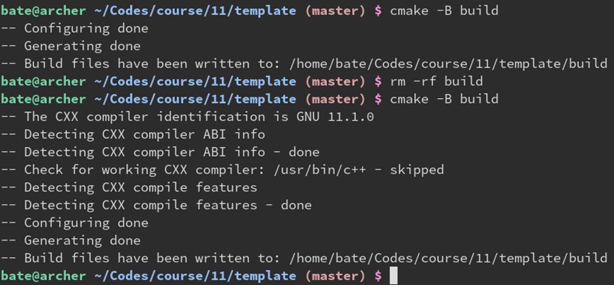

**清除缓存，其实只需删除 build/CMakeCache.txt 就可以了**

删 build 虽然彻底，也会导致编译的中间结果（.o文件）都没了，重新编译要花费很长时间。
如果只想清除缓存，不想从头重新编译，可以只删除 build/CMakeCache.txt 这个文件。
这文件里面装的就是缓存的变量，删了他就可以让 CMake 强制重新检测一遍所有库和编译器。

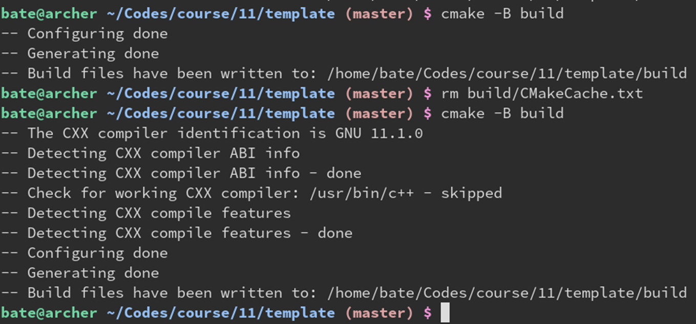

**build/CMakeCache.txt 的内容**

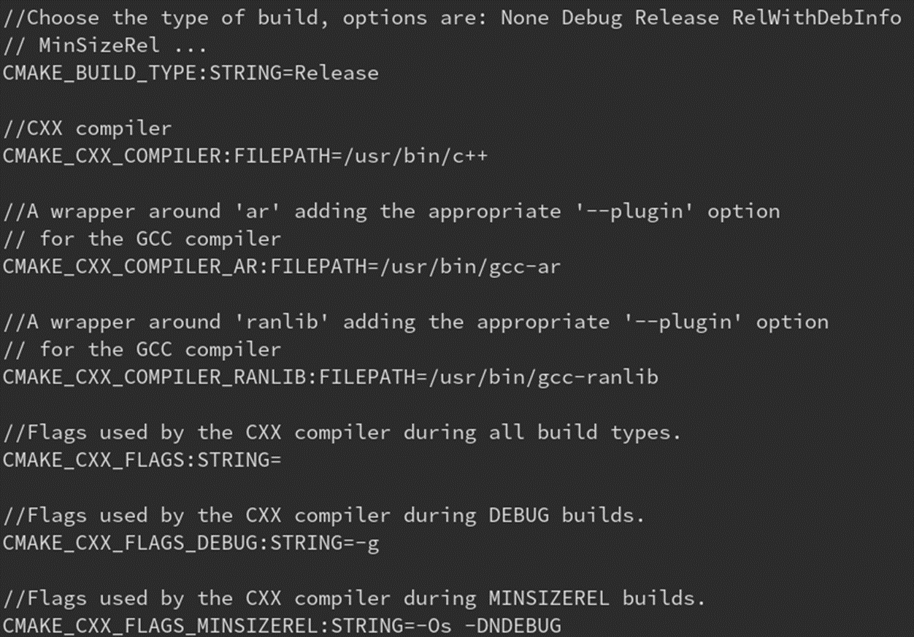

**find_package 就用到了缓存机制**

变量缓存的意义在于能够把 find_package 找到的库文件位置等信息，储存起来。
这样下次执行 find_package 时，就会利用上次缓存的变量，直接返回。
避免重复执行 cmake -B 时速度变慢的问题。

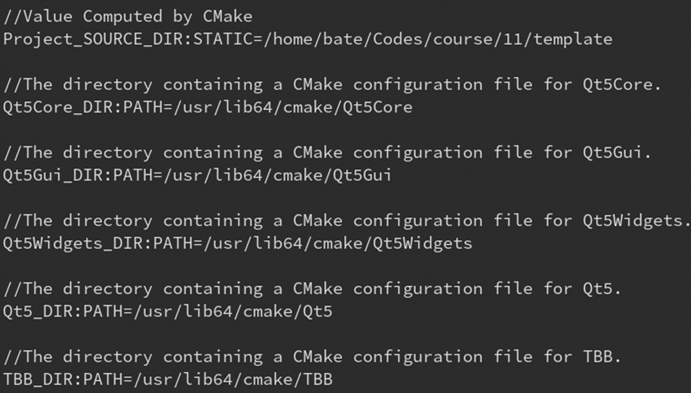

**设置缓存变量**

语法是：set(变量名 “变量值” CACHE 变量类型 “注释”)

```cmake
set(myvar "hello" CACHE STRING "this is the dicstring")
message("myvar is: ${myvar}")
```

缓存的 myvar 会出现在 build/CMakeCache.txt 里

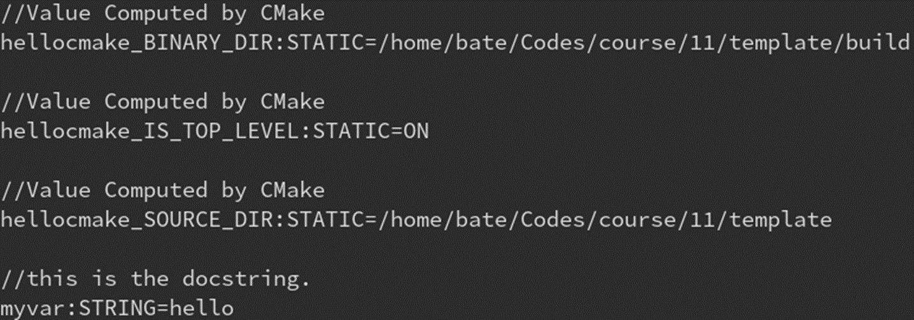

常见问题：我修改了 CMakeLists.txt 里 set 的值，却没有更新？

为了更新缓存变量，有的同学偷懒直接修改 CMakeLists.txt 里的值，这是没用的。
因为 set(... CACHE ...) 在缓存变量已经存在时，不会更新缓存的值！
CMakeLists.txt 里 set 的被认为是“默认值”因此不会在第二次 set 的时候更新。

**缓存变量到底该如何更新？标准解法：通过命令行 -D 参数**

更新缓存变量的正确方法，是通过命令行参数：cmake -B build -Dmyvar=world

**命令行 -D 参数太硬核了，有没有图形化的缓存编辑器？**

- 在 Linux 中，可以运行 ccmake -B build 来启动基于终端的可视化缓存编辑菜单。
- 在 Windows 则可以 cmake-gui -B build 来启动图形界面编辑各个缓存选项。
- 当然，直接用编辑器打开 build/CMakeCache.txt 修改后保存也是可以的。
- CMakeCache.txt 用文本存储数据，就是可供用户手动编辑，或是被第三方软件打开并解析的。

**缓存变量到底该如何更新？暴力解决：删 build 大法**

用万能的“删 build 大法”当然是可以的。这样重新执行的时候缓存变量不存在，
从而 set 会重新设置缓存的值为 world。建议初学者每次修改 CMakeLists.txt 时，
都删一下 build/CMakeCache.txt 方便调试。

**也可以通过指定 FORCE 来强制 set 更新缓存**

set 可以在后面加一个 FORCE 选项，表示不论缓存是否存在，都强制更新缓存。
不过这样会导致没办法用 -Dmyvar=othervalue 来更新缓存变量。

```cmake
set(myvar "world" CACHE STRING "this is the dicstring" FORCE)
message("myvar is: ${myvar}")
```

**缓存变量除了 STRING 还有哪些类型？**

- STRING 字符串，例如 “hello, world”
- FILEPATH 文件路径，例如 “C:/vcpkg/scripts/buildsystems/vcpkg.cmake”
- PATH 目录路径，例如 “C:/Qt/Qt5.14.2/msvc2019_64/lib/cmake/”
- BOOL 布尔值，只有两个取值：ON 或 OFF。
- 注意：TRUE 和 ON 等价，FALSE 和 OFF 等价；YES 和 ON 等价，NO 和 OFF 等价。

**案例：添加一个 BOOL 类型的缓存变量，用于控制要不要启用某特性**

```cmake
add_executable(main main.cpp)

set(WITH_TBB ON CACHE BOOL "set to ON to enable TBB, OFF to dosable TBB")
if (WITH_TBB)
	find_package(TBB REQUIRED)
	message(STATUS "TBB found at: ${TBB_DIR}")
	target_link_definitions(main PUBLIC WITH_TBB)
	target_link_libraries(main PUBLIC TBB::tbb)
endif()
```

**CMake 对 BOOL 类型缓存的 set 指令提供了一个简写：option**

```cmake
add_executable(main main.cpp)

option(WITH_TBB "set to ON to enable TBB, OFF to dosable TBB" ON)
if (WITH_TBB)
	find_package(TBB REQUIRED)
	message(STATUS "TBB found at: ${TBB_DIR}")
	target_link_definitions(main PUBLIC WITH_TBB)
	target_link_libraries(main PUBLIC TBB::tbb)
endif()
```

**经典问题：小彭老师，我option设为OFF了为什么他还是ON呀？**

```cmake
add_executable(main main.cpp)

option(WITH_TBB "set to ON to enable TBB, OFF to dosable TBB" OFF)
message("WITH_TBB: ${WITH_TBB}")
if (WITH_TBB)
	find_package(TBB REQUIRED)
	message(STATUS "TBB found at: ${TBB_DIR}")
	target_link_definitions(main PUBLIC WITH_TBB)
	target_link_libraries(main PUBLIC TBB::tbb)
endif()
```

因为在CMakeLists.txt里直接改option是错的，官方解法是通过-D参数来改

刚刚说了，option 等价于 set(... CACHE BOOL ...)。
因此在CMakeLists.txt里改同样不会立即更新缓存里的值。
官方推荐做法是通过 -D变量名:BOOL=ON/OFF 来改缓存变量。
这是cmake官方认为正确的缓存更新方式，但是很多人不知道，
还是傻傻的去改option里的值，然后发现没有效果，开始怀疑
cmake是不是出bug了，其实是官方宣传力度不够。

**或者不要option了，直接用set加个FORCE即可始终强制更新缓存**

当然最方便的还是删build大法，或者删build/CMakeCache.txt大法。
删build大法总能把缓存变量强制初始化为CMakeLists.txt里的值。

```cmake
add_executable(main main.cpp)

set(WITH_TBB OFF CACHE BOOL "set to ON to enable TBB, OFF to dosable TBB" FORCE)
message("WITH_TBB: ${WITH_TBB}")
if (WITH_TBB)
	find_package(TBB REQUIRED)
	message(STATUS "TBB found at: ${TBB_DIR}")
	target_link_definitions(main PUBLIC WITH_TBB)
	target_link_libraries(main PUBLIC TBB::tbb)
endif()
```

**绕开缓存的方法：使用普通变量，但仅当没有定义时设定为默认值**

一般来说CMake自带的变量（如CMAKE_BUILD_TYPE）都会这样设置。
这样项目的使用者还是可以用-D来指定参数，不过会在ccmake里看不到。

```cmake
add_executable(main main.cpp)

if (NOT DEFINED WITH_TBB)
	set(WITH_TBB ON)
endif()

message("WITH_TBB: ${WITH_TBB}")
if (WITH_TBB)
	find_package(TBB REQUIRED)
	message(STATUS "TBB found at: ${TBB_DIR}")
	target_link_definitions(main PUBLIC WITH_TBB)
	target_link_libraries(main PUBLIC TBB::tbb)
endif()
```

## 跨平台与编译器

**在 CMake 中给 .cpp 定义一个宏**

```c++
#include <cstdio>

int main() {
#ifdef MY_MACRO
    printf("MY_MACRO defind! value: %d\n", MY_MARCOR);
#else
    printf("MY_MACRO defind!\n");
#endif
}
```

```cmake
add_executable(main)

file(GLOB sources CONFIGURE_DEPENDS *.cpp *.h)
target_sources(main PUBLIC ${sources})
target_compile_definitions(main PUBLIC MY_MACRO=233)
```

**根据不同的操作系统，把宏定义成不同的值**

```cmake
add_executable(main)


file(GLOB sources CONFIGURE_DEPENDS *.cpp *.h)
target_sources(main PUBLIC ${sources})

if (CMAKE_SYSTEM_NAME MATCHS "Windows")
	target_compile_definitions(main PUBLIC MY_NAME="Bill Gates")
elseif (CMAKE_SYSTEM_NAME MATCHS "Linux")
	target_compile_definitions(main PUBLIC MY_NAME="Linus Torvalds")
elseif (CMAKE_SYSTEM_NAME MATCHS "Darwin")
	target_compile_definitions(main PUBLIC MY_NAME="Steve Jobs")
endif()
```

**CMake 还提供了一些简写变量：WIN32, APPLE, UNIX, ANDROID, IOS 等**

虽然名字叫 WIN32，实际上对 32 位 Windows 和 64 位 Windows 都适用
APPLE 对于所有苹果产品（MacOS 或 iOS）都为真
UNIX 对于所有 Unix 类系统（FreeBSD, Linux, Android, MacOS, iOS）都为真

```cmake
if (WIN32)
	target_compile_definitions(main PUBLIC MY_NAME="Bill Gates")
elseif (UNIX AND NOT APPLE)
	target_compile_definitions(main PUBLIC MY_NAME="Linus Torvalds")
elseif (APPLE)
	target_compile_definitions(main PUBLIC MY_NAME="Steve Jobs")
endif()
```

**使用生成器表达式，简化成一条指令**

https://cmake.org/cmake/help/latest/manual/cmake-generator-expressions.7.html#genex:PLATFORM_ID

语法：$<$<类型:值>:为真时的表达式>
比如 $<$<PLATFORM_ID:Windows>:MY_NAME=”Bill Gates”>
在 Windows 平台上会变为 MY_NAME=”Bill Gates”
其他平台上则表现为空字符串

```cmake
target_compile_definitions(main PUBLIC
	$<$<PLATFORM_ID:Windows>:MY_NAME="Bill Gates">
	$<$<PLATFORM_ID:Linux>:MY_NAME="Linus Torvalds">
	$<$<PLATFORM_ID:Darwin>:MY_NAME="Steve Jobs">
)
```

**生成器表达式：如需多个平台可以用逗号分割**

https://cmake.org/cmake/help/latest/manual/cmake-generator-expressions.7.html#genex:PLATFORM_ID

```cmake
target_compile_definitions(main PUBLIC
	$<$<PLATFORM_ID:Windows>:MY_NAME="DOS-like">
	$<$<PLATFORM_ID:Linux,Darwin,FreeBSD>:MY_NAME="Unix-like">
)
```

**判断当前用的是哪一款 C++ 编译器**

https://cmake.org/cmake/help/latest/variable/CMAKE_LANG_COMPILER_ID.html#variable:CMAKE_%3CLANG%3E_COMPILER_ID

```cmake
if (CMAKE_CXX_COMPILER_ID MATCHES "GUN")
	target_compile_definitions(main PUBLIC MY_NAME="gcc")
elseif (CMAKE_CXX_COMPILER_ID MATCHES "NVIDIA")
	target_compile_definitions(main PUBLIC MY_NAME="nvcc")
elseif (CMAKE_CXX_COMPILER_ID MATCHES "Clang")
	target_compile_definitions(main PUBLIC MY_NAME="clang")
elseif (CMAKE_CXX_COMPILER_ID MATCHES "MSVC")
	target_compile_definitions(main PUBLIC MY_NAME="msvc")
endif()
```

**也可以用生成器表达式判断编译器**

https://cmake.org/cmake/help/latest/variable/CMAKE_LANG_COMPILER_ID.html#variable:CMAKE_%3CLANG%3E_COMPILER_ID

```cmake
target_compile_definitions(main PUBLIC
	$<$<CXX_PLATFORM_ID:GUN,Clang>:MY_NAME="Open-source">
	$<$<CXX_PLATFORM_ID:MSCV,NVIDIA>:MY_NAME="Commercial">
)
```

**生成器表达式也可以做复杂的逻辑判断**

```cmake
target_compile_definitions(main PUBLIC
	$<$AND:$<CXX_PLATFORM_ID:GUN,Clang>,$<PLATFORM_ID:Linux,FreeBSD>>:MY_NAME="Open-source">
)
```

**CMake 还提供了一些简写变量：MSVC, CMAKE_COMPILER_IS_GNUCC**

```cmake
if (MSVC)
	target_compile_definitions(main PUBLIC MY_NAME="MSVC")
elseif (CMAKE_CXX_COMPILER_IS_GUNCC)
	target_compile_definitions(main PUBLIC MY_NAME="gcc")
else()
	target_compile_definitions(main PUBLIC MY_NAME="Other compiler")
endif()
```

**CMAKE_CXX_COMPILER_ID直接作为字符串变量**

```cmake
target_compile_definitions(main PUBLIC MY_NAME="the ${CMAKE_CXX_COMPILER_ID} Compiler") 
```

**从命令行参数指定编译器**

```shell
cmake -B build -DCMAKE_CXX_COMPILER="/usr/bin/clang++"
```

**也可以通过环境变量 CXX 指定**

```shell
CXX=`which clang` cmake -B build
```

**CMAKE_GENERATOR** **也可以了解一下**

```cmake
message("Generator: ${CMAKE_GENERATOR}")
message("C++ compiler: ${CMAKE_CXX_COMPILER}")
message("C compiler: ${CMAKE_C_COMPILER}")
```

## 分支与判断

### BOOL 类型的值

- 通常来说 BOOL 类型的变量只有 ON/OFF 两种取值。
- 但是由于历史原因，TRUE/FALSE 和 YES/NO 也可以表示 BOOL 类型。
- 个人建议同学们始终使用 ON/OFF 避免混淆。
- 当然 ON/NO 好像也挺顺口的x

- https://stackoverflow.com/questions/41079291/cmake-use-of-true-false-or-on-off-or-yes-no-in-generator-expressions
- https://cmake.org/cmake/help/v3.7/command/if.html

### **if** **的特点：不需要加** ${}，会自动尝试作为变量名求值**

由于历史原因，if 的括号中有着特殊的语法，如果是一个字符串，比如 MYVAR，则他会先
看是否有 ${MYVAR} 这个变量。如果有这个变量则会被替换为变量的值来进行接下来的比较，
否则保持原来字符串不变。

```cmake
set(MYVAR Hello)
if (MYVAR MATCHES "Hello")
	message("MYVAR is Hello")
else()
	message("MYVAR is not Hello")
endif()
```

**如果我加了 ${} 会怎么样呢？**

if (${MYVAR} MATCHES “Hello”) 会被翻译成 if (Hello MATCHES “Hello”)
但是因为找不到名为 Hello 的变量，所以会被直接当成普通的字符串来处理。
也就是 if (“Hello” MATCHES “Hello”) 从而会执行真分支，结果正常。

```cmake
set(MYVAR Hello)
if (${MYVAR} MATCHES "Hello")
	message("MYVAR is Hello")
else()
	message("MYVAR is not Hello")
endif()
```

**万一好巧不巧，正好定义了 Hello 这个变量呢？**

然而假如存在 Hello 这个变量，其值为 “world”。
那么 if (${MYVAR} MATCHES “Hello”) 会被翻译成 if (Hello MATCHES “Hello”)
而因为 Hello 这个变量名存在，所以会被（出于历史原因的）if 进一步求值：
if (“world” MATCHES “Hello”) 从而会执行假分支，结果不正常了。

```cmake
set(Hello world)
set(MYVAR Hello)
if (${MYVAR} MATCHES "Hello")
	message("MYVAR is Hello")
else()
	message("MYVAR is not Hello")
endif()
```

解决：用引号包裹起来，防止被当做变量名

初学者如果搞不明白，可以把所有不确定的地方都套上一层引号，
例如”${MYVAR}”，这样就可以避免被 if 当做变量名来求值了。

```cmake
set(Hello world)
set(MYVAR Hello)
if ("${MYVAR}" MATCHES "Hello")
	message("MYVAR is Hello")
else()
	message("MYVAR is not Hello")
endif()
```

## 变量与作用域

**变量的传播规则：**

- 父模块里定义的变量，会传递给子模块。
- 但是子模块里定义的变量，不会传递给父模块。
- 如果父模块里本来就定义了同名变量，则离开子模块后仍保持父模块原来设置的值。

**如果子模块需要向父模块里传变量怎么办？**

- 可以用 set 的 PARENT_SCOPE 选项，把一个变量传递到上一层作用域（也就是父模块）。
- 如果父模块里没有定义 MYVAR 的话，也可以用缓存变量向外部传变量（不推荐）。但是这样就不光父模块可见了，父模块的父模块，到处都可见。

**除了父子模块之外还有哪些是带独立作用域的**

- include 的 XXX.cmake **没有**独立作用域
- add_subdirectory 的 CMakeLists.txt **有**独立作用域
- macro **没有**独立作用域
- function **有**独立作用域
- （因此 PARENT_SCORE 也可以用于 function 的返回值）

- https://cmake.org/cmake/help/v3.16/command/set.html
- https://blog.csdn.net/Calvin_zhou/article/details/104060927

**环境变量的访问方式：$ENV{xx}**

- 用 ${xx} 访问的是局部变量，局部变量服从刚刚所说的父子模块传播规则。
- 而还有一种特殊的方式可以访问到系统的环境变量（environment variable）：$ENV{xx}。
- 比如 $ENV{PATH} 就是获取 PATH 这个环境变量的值。

```cmake
cmake_minmum_required(VERSION 3.15)
project(hellocmake)

message("PATH is: $ENV{PATH}")
```

**缓存变量的访问方式：$CACHE{xx}**

- 此外，还可以用 $CACHE{xx} 来访问缓存里的 xx 变量。
- 缓存变量和环境变量是不论父子模块都共用的，没有作用域一说。

```cmake
cmake_minmum_required(VERSION 3.15)
project(hellocmake)

message("CMAKE_BUILD_TYPE is: $CACHE{CMAKE_BUILD_TYPE}")
```

**${xx} 找不到局部变量时，会自动去找缓存变量**

- ${xx} 当找不到名为 xx 的局部变量时，就会去在缓存里查找名为 xx 的缓存变量。
- 因此这里 CMAKE_BUILD_TYPE 虽然在代码里没被 set，但是他被-D参数固定在缓存里了。
- 所以 ${CMAKE_BUILD_TYPE} 自动变成 $CACHE{CMAKE_BUILD_TYPE} 从而找到变量。

```cmake
cmake_minmum_required(VERSION 3.15)
project(hellocmake)

message("CMAKE_BUILD_TYPE is: $CACHE{CMAKE_BUILD_TYPE}")
```

**if (DEFINED xx) 判断某变量是否存在**

- if (DEFINED MYVAR) 可以判断是否存在 MYVAR 这个局部变量或缓存变量。

```cmake
cmake_minmum_required(VERSION 3.15)
project(hellocmake)

if (DEFINED MYVAR)
	message("MYVAR is: ${MYVAR}")
else()
	message("MYVAR not defined")
endif()
```

- 值得注意的是：空字符串不代表变量不存在。因此即使是空字符串 DEFINED 也认为存在。

```cmake
cmake_minmum_required(VERSION 3.15)
project(hellocmake)

set(MYVAR "")
if (DEFINED MYVAR)
	message("MYVAR is: ${MYVAR}")
else()
	message("MYVAR not defined")
endif()
```

- 可以直接用 if (xx) 来判断是否为空字符串，因为空字符串等价于 FALSE。

```cmake
cmake_minmum_required(VERSION 3.15)
project(hellocmake)

set(MYVAR "")
if (MYVAR)
	message("MYVAR is: ${MYVAR}")
else()
	message("MYVAR not defined")
endif()
```

**if (DEFINED ENV{xx}) 判断某环境变量是否存在**

- 因为 $ENV{xx} 代表环境变量，因此在 set 和 if 中也可以用 ENV{xx} 来表示环境变量。

  因为 set 的第一参数和 if 的参数都是不加 $ 的，所以要设置 ${x} 就变成了 set(x ...)。而设置 $ENV{x} 自然就是 set(ENV{x} ...) 咯。
  同理还可以用 if (DEFINED CACHE{x}) 判断是否存在这个缓存变量，但是 set(CACHE{x} ...) 就不行。

```cmake
cmake_minmum_required(VERSION 3.15)
project(hellocmake)

set(ENV{MYVAR} "hello")
if (DEFINED ENV{MYVAR})
	message("MYVAR is: ${MYVAR}")
else()
	message("MYVAR not defined")
endif()
```

- 从 bash 设置环境变量试试看

```cmake
cmake_minmum_required(VERSION 3.15)
project(hellocmake)

if (DEFINED ENV{MYVAR})
	message("MYVAR is: ${MYVAR}")
else()
	message("MYVAR not defined")
endif()
```

```shell
export MYVAR=world
```

## 其他小建议

**CCache：编译加速缓存**

- 用法：把 gcc -c main.cpp -o main 换成 ccache gcc -c main.cpp -o main 即可

- 在 CMake 中可以这样来启用 ccache（就是给每个编译和链接命令前面加上 ccache）：

  ```cmake
  cmake_minmum_required(VERSION 3.15)
  project(hellocmake)
  
  find_program(CCACHE_PROGRAM ccache)
  if (CCACHE_PROGRAM)
  	message(STATUS "Found CCache: ${CCACHE_PROGRAM}")
  	set_property(GLOBAL PROPERTY RUL_LAUNCH_COMPILE ${CCACHE_PROGRAM})
  	set_property(GLOBAL PROPERTY RUL_LAUNCH_LINK ${CCACHE_PROGRAM})
  endif()
  ```

- CCache 官方网站：https://ccache.dev/（不过好像不支持 MSVC 的样子……）

**添加一个 run 伪目标，用于启动主程序（可执行文件）**

- 创建一个 run 伪目标，其执行 main 的可执行文件。
- 这里用了生成器表达式 $<TARGET_FILE:main>，会自动让 run 依赖于 main。
- 如果不放心有没有自动依赖上，手动加一个 add_dependencies(run main) 也是可以的。
- 这样就可以在命令行运行 cmake --build build --target run 来启动 main.exe 运行了。
- 而不必根据不同的平台，手动写出 build/main 或是 build\main.exe。

```cmake
add_executable(main main.cpp)

add_custom_target(run COMMAND $<TARGET_FILE:main>)
```

**再加一个** **configure** **伪目标，用于可视化地修改缓存变量**

- 这样就可以用	cmake --build build --target configure 来启动 ccmake 修改缓存了。
- 这在 Linux 上相当于 ccmake -B build，Windows 则是 cmake-gui -B build。

```cmake
add_executable(main main.cpp)

add_custom_target(run COMMAND $<TARGET_FILE:main>)
if (CMAKE_EDIT_COMMAND)
	add_custom_target(configure COMMAND ${CMAKE_EDIT_COMMAND} -B ${CMAKE_BINARY_DIR})
endif()
```

